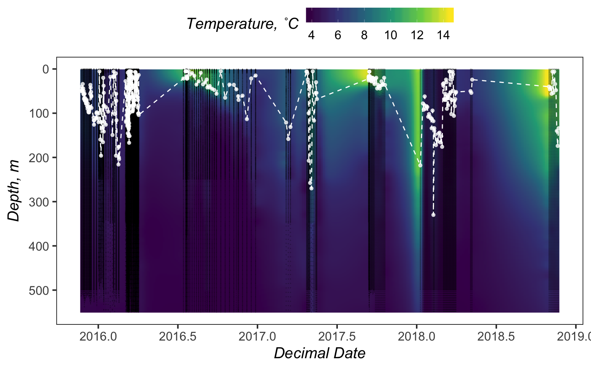

ARGO
================
Nicholas Baetge
2/6/2020

# Intro

This document highlights how MLDs were calculated from the ARGO floats
deployed on the NAAMES cruises.

  - Input data, which were the level 2 processed data, were pulled from
    the [NAAMES data page](https://naames.larc.nasa.gov/data2018.html)
  - MLDs were calculated using the N<sup>2</sup> buoyancy frequency and
    are defined as the depth below 5 m at which N<sup>2</sup> \>
    |stdev(N<sup>2</sup>)|

# Import and Wrangle Data

``` r
#pass all the filenames of everything in a float folder into a variable
filenames <- list.files("~/naames_export_ms/Input/Argo/lovbio030b/",pattern = "*.csv", full.names = T) 
profile.names <- list.files("~/naames_export_ms/Input/Argo/lovbio030b/",pattern = "*.csv", full.names = F) 
profile.number <- gsub('.csv', '', profile.names) %>% 
  gsub('lovbio030b.', '', .) %>% 
  as.numeric(.)

#now go through all the files in the folder, pick out the filenames, and pass them into the variable 'filenames'. use the file names to interate through the files, extracting the data from each csv, and combining it into one list
master <-  lapply(filenames, function(i){
  read_csv(i)
})
names(master) <- profile.number

#convert to data frame
profiles <- bind_rows(master, .id = "id")

#save csv
#write_csv(profiles, "lovbio030b_profiles.csv")
```

``` r
#load each float dataset
lovbio014b <- read_csv("~/naames_export_ms/Input/Argo/lovbio014b_profiles.csv") %>%  
  mutate(float = "lovbio014b") %>% select(float, id, datetime:s, chla_adj) %>%
  rename(chla = chla_adj)
lovbio030b <- read_csv("~/naames_export_ms/Input/Argo/lovbio030b_profiles.csv") %>%  
  mutate(float = "lovbio030b") %>% select(float, id, datetime:s, chla_adj) %>%
  rename(chla = chla_adj)
lovbio032b <- read_csv("~/naames_export_ms/Input/Argo/lovbio032b_profiles.csv") %>%  
  mutate(float = "lovbio032b") %>% select(float, id, datetime:s, chla_adj) %>%
  rename(chla = chla_adj)
metbio003d <- read_csv("~/naames_export_ms/Input/Argo/metbio003d_profiles.csv") %>%  
  mutate(float = "metbio003d") %>% select(float, id, datetime:s, chla_adj) %>%
  rename(chla = chla_adj)
metbio010d <- read_csv("~/naames_export_ms/Input/Argo/metbio010d_profiles.csv") %>%  
  mutate(float = "metbio010d") %>% select(float, id, datetime:s, chla_adj) %>%
  rename(chla = chla_adj)
#this dataset contained NANs which are problematic for the potential temperature and n2 calculations. thus, they are removed here. 
metbio010d <- metbio010d[complete.cases(metbio010d),] 
n0572 <- read_csv("~/naames_export_ms/Input/Argo/n0572_profiles.csv") %>%  
  mutate(float = "n0572") %>% select(float, id, datetime:s, o2_c, chla_adj) %>%
  rename(chla = chla_adj)
n0573 <- read_csv("~/naames_export_ms/Input/Argo/n0573_profiles.csv") %>%  
  mutate(float = "n0573") %>% select(float, id, datetime:s, o2_c, chla_adj) %>%
  rename(chla = chla_adj)
n0574 <- read_csv("~/naames_export_ms/Input/Argo/n0574_profiles.csv") %>%  
  mutate(float = "n0574") %>% select(float, id, datetime:s, o2_c, chla_adj) %>%
  rename(chla = chla_adj)
n0646 <- read_csv("~/naames_export_ms/Input/Argo/n0646_profiles.csv") %>%  
  mutate(float = "n0646") %>% select(float, id, datetime:s, o2_c, chla_adj) %>%
  rename(chla = chla_adj)
n0647 <- read_csv("~/naames_export_ms/Input/Argo/n0647_profiles.csv") %>%  
  mutate(float = "n0647") %>% select(float, id, datetime:s, o2_c, chla_adj) %>%
  rename(chla = chla_adj)
n0648 <- read_csv("~/naames_export_ms/Input/Argo/n0648_profiles.csv") %>%  
  mutate(float = "n0648") %>% select(float, id, datetime:s, o2_c, chla_adj) %>%
  rename(chla = chla_adj)
n0846 <- read_csv("~/naames_export_ms/Input/Argo/n0846_profiles.csv") %>%  
  mutate(float = "n0846") %>% select(float, id, datetime:s, o2_c, chla_adj) %>%
  rename(chla = chla_adj)
n0847 <- read_csv("~/naames_export_ms/Input/Argo/n0847_profiles.csv") %>%  
  mutate(float = "n0847") %>% select(float, id, datetime:s, o2_c, chla_adj) %>%
  rename(chla = chla_adj)
n0848 <- read_csv("~/naames_export_ms/Input/Argo/n0848_profiles.csv") %>%  
  mutate(float = "n0848") %>% select(float, id, datetime:s, o2_c, chla_adj) %>%
  rename(chla = chla_adj)
n0849 <- read_csv("~/naames_export_ms/Input/Argo/n0849_profiles.csv") %>%  
  mutate(float = "n0849") %>% select(float, id, datetime:s, o2_c, chla_adj) %>%
  rename(chla = chla_adj)
n0850 <- read_csv("~/naames_export_ms/Input/Argo/n0850_profiles.csv") %>%  
  mutate(float = "n0850") %>% select(float, id, datetime:s, o2_c, chla_adj) %>%
  rename(chla = chla_adj)
n0851 <- read_csv("~/naames_export_ms/Input/Argo/n0851_profiles.csv") %>%  
  mutate(float = "n0851") %>% select(float, id, datetime:s, o2_c, chla_adj) %>%
  rename(chla = chla_adj)
n0852 <- read_csv("~/naames_export_ms/Input/Argo/n0852_profiles.csv") %>%  
  mutate(float = "n0852") %>% select(float, id, datetime:s, o2_c, chla_adj) %>%
  rename(chla = chla_adj)

#combine all the float data
#this first set of floats don't have O2 data
collab_floats.df <- rbind(lovbio014b, lovbio030b, lovbio032b, metbio003d, metbio010d) %>% 
  rename(profile = id) 

naames_floats.df <- rbind(n0572, n0573, n0574, n0647, n0648, n0846, n0847, n0848, n0849, n0850, n0851, n0852) %>% 
  rename(profile = id)

all_floats.df <- naames_floats.df %>% 
  select(-o2_c) %>% 
  rbind(., collab_floats.df) %>% 
  drop_na() 
```

# Calculations

## MLDs

``` r
float_mld.df  <- all_floats.df %>% 
  group_by(float, profile, datetime) %>% 
  mutate(sigmaT = swSigmaTheta(s, temperature = t, pressure = p, referencePressure = 0), 
         N2 = swN2(pressure = p, sigmaTheta = sigmaT),
         Date = as.Date(datetime, "%m/%d/%y"), 
         Month = month(Date)) %>% 
  #include only depths below 5 m and where  N2 is > abs(stdev(N2))
  filter(p > 5 & N2 > abs(sd(N2))) %>%  
  filter(p == min(p)) %>% #report the shallowest depth at which the above condition is met
  rename(MLD = p) %>% 
  ungroup() %>% 
  select(float, profile, datetime, Date, Month, lat:MLD) %>% 
  #set longitudinal and latitudinal bounds based on the extent of the NAAMES region
  filter(between(lon, -47, -38),
         between(lat, 39,57)) %>% 
  mutate(bin = round(lat)) %>% 
  arrange(bin, Date) %>%
  select(float:datetime, lat, lon, bin, MLD) %>% 
  group_by(bin) %>% 
  add_tally() %>% 
  rename(nperbin = n) %>% 
  ungroup()

mld_winter <- float_mld.df %>% 
  select(float, profile, datetime, bin) %>%
  mutate(month = month(datetime)) %>% 
  filter(month %in% c(11,12,1,2,3,4)) %>% 
  select(float, profile, month, bin) %>% 
  group_by(bin) %>% 
  add_tally() %>% 
  rename(nperwinter = n) %>% 
  select(bin, nperwinter) %>% 
  distinct() %>% 
  ungroup()

float_mld.df <- left_join(float_mld.df, mld_winter)
```

## Chl

``` r
float_chl.df <- all_floats.df %>% 
  #set longitudinal and latitudinal bounds based on the extent of the NAAMES region
  filter(between(lon, -47, -38),
         between(lat, 39,57)) %>% 
  group_by(float, profile, datetime) %>% 
  select(float:t, chla) %>% 
  #correct the chlorophyll data for each profile by subtracting the min from each observation
  mutate(min_fl = min(chla),
         cor_fl = chla - min_fl) %>% 
  select(float:t, cor_fl)
```

## Max MLD

``` r
float_combined.df <- left_join(float_mld.df, float_chl.df) %>% 
  mutate(decimaldate = decimal_date(datetime)) %>% 
  ungroup() %>%
  select(float, profile, datetime, decimaldate, lat, lon, bin, MLD, nperbin, nperwinter, p, t, cor_fl) %>% 
  drop_na() %>% 
  arrange(bin, decimaldate) 

max_mld.df <- float_combined.df %>% 
  arrange(bin, datetime) %>% 
  group_by(bin) %>% 
  select(float:nperwinter) %>% 
  distinct() %>% 
  mutate(max_mld = max(MLD)) %>% 
  filter(MLD == max_mld) %>% 
  select(-MLD) %>% 
  distinct(.) %>% 
  mutate(date = date_decimal(decimaldate),
         mon = month(date, label=TRUE, abbr=TRUE),
         year = year(date)) %>% 
  arrange(bin) %>% 
  select(bin, nperbin, nperwinter, max_mld, float, profile, mon, year, lat, lon )

#saveRDS(max_mld.df, "~/Google Drive File Stream/Shared drives/NAAMES_Carlson/DATA/FINAL/MANUSCRIPT_DATA/Export_MS/Output/max_mld.rds")
```

| bin | nperbin | nperwinter | max\_mld | float      | profile | mon | year |      lat |        lon |
| --: | ------: | ---------: | -------: | :--------- | ------: | :-- | ---: | -------: | ---------: |
|  39 |      52 |         52 |    294.0 | n0851      |     152 | Apr | 2018 | 39.18970 | \-40.29010 |
|  40 |      17 |         17 |    484.0 | n0852      |     113 | Mar | 2018 | 39.85230 | \-42.13640 |
|  41 |      49 |         26 |    478.0 | n0852      |     105 | Mar | 2018 | 41.15090 | \-41.49080 |
|  42 |     114 |         61 |    418.0 | n0852      |     103 | Feb | 2018 | 41.57950 | \-41.06190 |
|  42 |     114 |         61 |    418.0 | n0852      |     150 | Apr | 2018 | 42.16620 | \-42.20900 |
|  43 |      66 |         51 |    416.0 | n0852      |     148 | Apr | 2018 | 42.91960 | \-43.86390 |
|  43 |      66 |         51 |    416.0 | n0852      |     149 | Apr | 2018 | 42.56660 | \-43.01800 |
|  44 |     173 |         89 |    368.0 | n0850      |     100 | Feb | 2018 | 44.39350 | \-43.68720 |
|  45 |     113 |         49 |    404.0 | n0850      |      96 | Feb | 2018 | 45.09000 | \-42.95190 |
|  46 |      78 |         37 |    416.0 | n0572      |      49 | Feb | 2016 | 45.94860 | \-38.82450 |
|  47 |     132 |          9 |    336.0 | n0849      |     106 | Mar | 2018 | 47.21110 | \-39.06920 |
|  48 |      90 |         27 |    508.0 | n0849      |     105 | Mar | 2018 | 48.01290 | \-38.83260 |
|  49 |      92 |         46 |    448.0 | n0647      |      94 | Feb | 2017 | 48.81720 | \-41.74480 |
|  50 |     181 |        159 |    406.0 | n0647      |      97 | Mar | 2017 | 50.42140 | \-40.91630 |
|  51 |     177 |        165 |    386.0 | n0849      |      96 | Feb | 2018 | 50.88810 | \-40.45680 |
|  52 |     348 |        274 |    330.0 | n0849      |      90 | Feb | 2018 | 51.60300 | \-44.00300 |
|  53 |     375 |        223 |    230.5 | lovbio014b |   18400 | Mar | 2016 | 53.35727 | \-40.07517 |
|  54 |     219 |        158 |    222.7 | lovbio014b |   17300 | Dec | 2015 | 54.07244 | \-44.11888 |
|  55 |      39 |         32 |    241.3 | lovbio030b |   21500 | Jan | 2016 | 54.82318 | \-45.90412 |
|  56 |      54 |         11 |    109.6 | lovbio014b |   16800 | Nov | 2015 | 55.59245 | \-44.25288 |
|  57 |      56 |          5 |    284.0 | n0648      |     205 | Feb | 2018 | 56.74900 | \-46.73290 |

ARGO Maximum Mixed Layers

# ODV style plot

## Interpolate temperature data

``` r
#subset the temperature and the mld data separately

t.df <- float_combined.df %>% 
  #deepest mixed layer observed from floats in NAAMES region was 508
  filter(between(p, 0, 550)) %>% 
  select(bin, decimaldate, p, t) %>% 
  arrange(decimaldate, bin) %>% 
  group_by(bin) 

mld.df <- float_combined.df %>% 
  filter(between(p, 0, 550)) %>% 
  select(bin, decimaldate, MLD) %>% 
  arrange(decimaldate, bin) %>% 
  group_by(bin) 

#split chl data into a list by latitudinal bin
t.list <- split(t.df, t.df$bin)

#create function to interpolate chl
interp.func <- function(casper) {
  dog <- casper %>% 
    ungroup() %>% 
    #the interpolation requires that the dataframe be comprised of only 3 columns (x, y, z)
    select(-bin) 
  mba <- mba.surf(dog, no.X = 300, no.Y = 300, extend = T)
  dimnames(mba$xyz.est$z) <- list(mba$xyz.est$x, mba$xyz.est$y)
  mba <- melt(mba$xyz.est$z, varnames = c('decimaldate', 'p'), value.name = 't') %>% 
    filter(p > 0)
}

#apply the interpolation function to the list
interpolated_t.list <- lapply(t.list, interp.func)

#convert the list into a df for plotting
interpolated_t.df <- data.frame(rbindlist(interpolated_t.list, idcol = T)) %>% 
  mutate(.id = as.numeric(.id)) %>% 
 rename(bin = .id) %>% 
  arrange(decimaldate, bin) %>% 
  group_by(bin) 
```

## Plot


