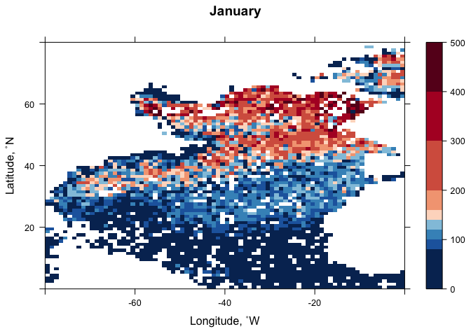

Export MS Supplemental Climatology Analysis
================
Nicholas Baetge
1/22/2020

# Intro

These analyses were conducted in order to respond to the suggestion to
validate our results with publicly available datasets.

1.  Here, we have used
    [GLODAPv2\_2019](https://www.nodc.noaa.gov/archive/arc0133/0186803/2.2/data/0-data/)
    and [WOA18](https://www.nodc.noaa.gov/OC5/woa18/woa18data.html)
    constiuent and climatological data to verify the mixed nitrate and
    silicate profiles approximated in the manuscript. We also used the
    freely available data to estimate NCP from both nitrate and
    TCO<sub>2</sub> drawdown and compared those estimates to the ones in
    the manuscript.

2.  We also analyzed UCSD’s ARGO monthly maximum MLD climatology data
    product to explore interannual variability in maximum mixed layer
    depths.

# Manuscript Data

``` r
export_summary <- read_rds("~/Google Drive File Stream/Shared drives/NAAMES_Carlson/DATA/FINAL/MANUSCRIPT_DATA/Export_MS/Output/processed_export.rds")

mlds <-  read_rds("~/Google Drive File Stream/Shared drives/NAAMES_Carlson/DATA/FINAL/MANUSCRIPT_DATA/Export_MS/Output/processed_bf.2.2020.rds") %>% 
  select(Season, Station, CampCN, degree_bin, Latitude, Max_MLD, Z_MLD) %>%
  group_by(Season, Station) %>% 
  mutate(mean_mld = mean(Z_MLD),
         sd_mld = sd(Z_MLD),
         ave_lat = mean(Latitude)) %>% 
  ungroup() %>% 
  select(Season, Station, degree_bin, ave_lat, Max_MLD, mean_mld, sd_mld) %>% 
  distinct() 

naames_mld <- mlds %>% 
  select(-Max_MLD, -ave_lat) %>% 
  distinct()

argo_mld <- mlds %>% 
  select(degree_bin, Max_MLD) %>% 
  distinct() 
```

# GLODAPv2\_2019

This dataset is described in:  
*Olsen, A., R. M. Key, S. van Heuven, S. K. Lauvset, A. Velo, X. Lin, C.
Schirnick, A. Kozyr, T. Tanhua, M. Hoppema, S. Jutterström, R.
Steinfeldt, E. Jeansson, M. Ishii, F. F. Pérez and T. Suzuki. The Global
Ocean Data Analysis Project version 2 (GLODAPv2) – an internally
consistent data product for the world ocean, Earth Syst. Sci. Data, 8,
297–323, 2016, <doi:10.5194/essd-8-297-2016>.*

Here is the
[readme](https://www.nodc.noaa.gov/archive/arc0133/0186803/2.2/data/0-data/README.txt)

### Data wrangling

``` r
glodap <- read_csv("https://www.nodc.noaa.gov/archive/arc0133/0186803/2.2/data/0-data/GLODAPv2.2019_Atlantic_Ocean.csv")
```

We are only including variables we’re interested in as well as data that
are co-located in the NAAMES study region.

``` r
glodap.region <- glodap %>% 
  select(cruise:longitude, bottle:temperature, salinity:salinityqc, nitrate:nitrateqc, silicate:silicateqc, tco2:tco2qc) %>% 
  filter(between(longitude, -47, -38),
         between(latitude, 39, 57)) %>% 
  mutate(bin = round(latitude)) %>% 
  mutate_all(funs(gsub(-9999, NA, .))) 
```

``` r
str(glodap.region)
```

    ## Classes 'spec_tbl_df', 'tbl_df', 'tbl' and 'data.frame': 13294 obs. of  27 variables:
    ##  $ cruise     : chr  "23" "23" "23" "23" ...
    ##  $ station    : chr  "51" "52" "53" "53" ...
    ##  $ cast       : chr  "1" "1" "1" "1" ...
    ##  $ year       : chr  "1996" "1996" "1996" "1996" ...
    ##  $ month      : chr  "6" "6" "6" "6" ...
    ##  $ day        : chr  "17" "17" "17" "17" ...
    ##  $ hour       : chr  "0" "0" "0" "0" ...
    ##  $ minute     : chr  "0" "0" "0" "0" ...
    ##  $ latitude   : chr  "48.352" "48.578" "48.618" "48.618" ...
    ##  $ longitude  : chr  "-46.535" "-45.716" "-45.354" "-45.354" ...
    ##  $ bottle     : chr  "1" "1" "1" "2" ...
    ##  $ pressure   : chr  "5.0381" "5.0381" "5.0381" "5.6426" ...
    ##  $ depth      : chr  "5" "5" "5" "5.6" ...
    ##  $ temperature: chr  "4.8" "6.637" "6.586" "6.56" ...
    ##  $ salinity   : chr  "33.784" "33.793" "34.041" "33.999" ...
    ##  $ salinityf  : chr  "2" "2" "2" "2" ...
    ##  $ salinityqc : chr  "1" "1" "1" "1" ...
    ##  $ nitrate    : chr  NA NA NA NA ...
    ##  $ nitratef   : chr  "9" "9" "9" "9" ...
    ##  $ nitrateqc  : chr  "1" "1" "1" "1" ...
    ##  $ silicate   : chr  NA NA NA NA ...
    ##  $ silicatef  : chr  "9" "9" "9" "9" ...
    ##  $ silicateqc : chr  "1" "1" "1" "1" ...
    ##  $ tco2       : chr  "2034.9" "2044.8" "2054.5" "2054.1" ...
    ##  $ tco2f      : chr  "2" "2" "2" "2" ...
    ##  $ tco2qc     : chr  "1" "1" "1" "1" ...
    ##  $ bin        : chr  "48" "49" "49" "49" ...

### Winter profiles

We want to plot the winter profiles and estimate the nitrate and
silicate concentrations within the mixed layers of the profiles. We’ll
need to wrangle the data first:

  - restrict data to winter months (Jan - March)
  - estimate MLDs using the temperature criterion of de Boyer Montegut,
    2004: *“…threshold value of temperature or density from a
    near-surface value at 10 m depth (\(∆T = 0.2°C\) or
    \(∆\sigma = 0.03\) \(kg\) \(m^{-3}\)).”*

<!-- end list -->

``` r
glodap.winter <- glodap.region %>% 
  filter(month %in% c(1,2,3)) %>% 
  drop_na(nitrate) %>% 
  #the dataframe is composed of character data, so we will coerce  all the data into numerics
  data.matrix() %>% 
  as_tibble() %>% 
  group_by(cruise, station) %>% 
  arrange(bin, cruise, station, bottle) %>% 
  mutate(bin_plot = paste(bin, "˚N", sep = ""),
         #convert nutrients to µmol/L and TCO2 to mol/l
         nitrate = nitrate * 1.025,
         silicate = silicate * 1.025,
         tco2 = (tco2 * 1.025)/1000,
         #identify near surface temperature
         surf_t = ifelse(depth == 10, temperature, NA),
         #calculate the temperature threshold
         mld_t = surf_t - 0.2) %>% 
  fill(surf_t:mld_t, .direction = "up") %>% 
  ungroup() %>% 
  select(cruise:longitude, bin, bin_plot, everything())
```

``` r
unique(glodap.winter$cruise)
```

    ## [1] 58

``` r
unique(glodap.winter$station)
```

    ## [1] 180 181

**The restricted dataset only includes data from one cruise and two
stations i.e. there are only two winter nutrient profiles in the NAAMES
region this dataset.**

To be able to estimate MLDs, we’ll need to interpolate the depth at
which the temperature threshold is reached. We’ll then need to
interpolate the relevant data for that depth.

``` r
#split the dataframe into a list, by station
glodap.winter.list <-  split(glodap.winter, glodap.winter$station)
```

``` r
#create a function that adds an empty row to each station and also inputs the temperature threshold value int to the temperature column
addz.func <- function(a){
  #add an empty row to each list element
  a[nrow(a) + 1,] <- NA
  #add the mld_t value to the empty field in the temperature column
  a$temperature[is.na(a$temperature)] <- max(a$mld_t, na.rm = T)
  #fill the metadata for the empty row
  b <- a %>% 
    fill(., cruise:bin_plot, .direction = c("downup")) 
  }
```

``` r
#apply function to list
added.mld_t.list <- lapply(glodap.winter.list, addz.func)
```

``` r
#save the list as a data frame 
added.mld_t.df <- plyr::ldply(added.mld_t.list, data.frame) %>% 
  group_by(station) %>% 
  distinct(., temperature, .keep_all = T) %>% 
  select(-.id) %>% 
  ungroup() %>% 
  arrange(station,  temperature)
```

``` r
#again, split the dataframe into a list
to_interpolate.list <- split(added.mld_t.df, added.mld_t.df$station)
```

``` r
#create a function that will linearly interpolate each variable according to the depth intervals of the casts 
interpolate.func <- function(a) {
b <- a %>% 
  select(depth:ncol(.)) %>% 
  zoo(., order.by = .$temperature) 
interp_depth <- round(as.numeric(na.approx(b$depth, na.rm = F)))
c <- a %>% 
  mutate(depth = interp_depth)
d <- c %>%
  select(depth:ncol(.)) %>% 
  zoo(., order.by = .$depth)
interp_nitrate <- as.numeric(na.approx(d$nitrate, na.rm = F))
interp_silicate <- as.numeric(na.approx(d$silicate, na.rm = F))
interp_tco2 <- as.numeric(na.approx(d$tco2, na.rm = F))
depth <- d$depth
temperature <- d$temperature
e <- data.frame(depth, temperature, interp_nitrate, interp_silicate, interp_tco2)

}
```

``` r
#apply function to list 
interpolations.list <- lapply(to_interpolate.list, interpolate.func)
```

``` r
#save the list as a data frame 
interpolations.df <- plyr::ldply(interpolations.list, data.frame) %>% 
  rename(., station = .id) 
```

``` r
#combine the interpolated and non-interpolated data frames 
interpolations.df$station <- as.numeric(interpolations.df$station)
interpolated.df <- right_join(added.mld_t.df, interpolations.df) %>%
  group_by(station) %>% 
  arrange(station, depth) %>% 
  fill(., cruise, cast:bin_plot, mld_t, .direction = "downup") %>% 
  select(-surf_t)
```

``` r
#identify the mld and calculate the mixed conditions
glodap.winter.interp <- interpolated.df %>%
  group_by(station) %>% 
  mutate(mld = ifelse(temperature == mld_t, depth, NA)) %>% 
  fill(mld, .direction = "downup") 
```

``` r
#plot the profiles with an indication of the MLD
n.prof <-  glodap.winter.interp %>% 
  filter(depth <= 1500) %>% 
  ggplot(aes(x = depth, group = bin_plot, y = interp_nitrate)) +
  geom_segment(aes( x = mld, xend = mld, y = 0, yend = 25, group = bin), colour="black", linetype = 2, size = 1.5 ) +
  geom_line(size = 0.7) +
  geom_point(size = 6, shape = 21, color = "black", stroke = 1, alpha = 0.7) + 
  labs(x = expression(paste("")), y = expression(paste("NO"[3],", µmol N L"^"-1")), colour = "") +
  scale_x_reverse(breaks = pretty_breaks(), expand = c(0,0)) +
  coord_flip() +
  scale_y_continuous(expand = c(0,0), sec.axis = dup_axis(), limits = c(0,25)) +
  guides(colour = F) +
  guides(fill = F) +
  custom_theme() +
  facet_wrap(~bin_plot) +
  theme(panel.spacing.x = unit(2, "cm"))

n.prof
```


**Only one of these profiles reflect a possible winter mixed condition**

``` r
glodap.winter.cond <- glodap.winter.interp %>% 
  filter(station == 181,
         depth <= mld) %>% 
  mutate(winter_n = mean(interp_nitrate),
         winter_si = mean(interp_silicate),
         winter_tco2 = mean(interp_tco2)) %>% 
  ungroup() %>% 
  select(bin, mld, winter_n:winter_tco2) %>% 
  distinct()
```

| bin | mld | winter\_n | winter\_si | winter\_tco2 |
| --: | --: | --------: | ---------: | -----------: |
|  42 | 445 |   4.47446 |    1.91932 |     2.157644 |

Gv2\_2019 Winter Conditions

## Caclulate NCP from TCO<sub>2</sub> profiles

We’ll calculate seasonal NCP, from winter to spring and winter to
summer, depth-integrated to 100 m. These are the most comparable
estimates to those presented in the manuscript.

Because there was only one latitudinal bin in the NAAMES study region
that had a profile reflecting deep mixing, we will restrict the data to
that bin.

Below shows how seasonal NCP was calculated from the winter to the
spring. The same workflow was done for the period of winter to summer,
but that is not shown.

### Spring NCP

``` r
glodap.spring <- glodap.region %>% 
  filter(month %in% c(4,5,6)) %>% 
  drop_na(tco2) %>% 
  data.matrix() %>% 
  as_tibble() %>% 
  filter(bin == 42) %>% 
  group_by(station) %>% 
  arrange(station, bottle) %>% 
  mutate(min_depth = min(depth)) %>% 
  #filter out casts in which the minimum depth sampled is >=20 m 
  filter(!min_depth >= 20) %>% 
  filter(depth <= 100) %>% 
  ungroup() %>% 
  #restict data to stations with >= 3 observations
  filter(station %in% c(64, 78)) %>% 
  ungroup()
```

``` r
#create a function to add an empty row0 and 100 m  
add_0_100.func <- function(a){
  a[nrow(a) + 1,] <- NA
  a$depth[is.na(a$depth)] <- 0
  
  b <- a %>% 
    fill(., cruise:longitude, .direction = "downup") %>% 
    arrange(station, depth)
  
  b[nrow(b) + 1,] <- NA
  b$depth[is.na(b$depth)] <- 100
  
  c <- b %>% 
    fill(., cruise:longitude, .direction = "downup") %>% 
    arrange(station, depth)
  
}
```

``` r
#split df into list
add.spring.list <- split(glodap.spring, glodap.spring$station)
#apply function to list
added.spring.list <- lapply(add.spring.list, add_0_100.func)
```

``` r
#save the list as a data frame 
added.spring.df <- plyr::ldply(added.spring.list, data.frame) %>% 
  group_by(station) %>% 
  distinct(., depth, .keep_all = T) %>% 
  select(-.id) %>% 
  #the nearest values to 0 m and 100 m are 9-11 and 98-99 m, respectively. so, we can fill the TCO2 values for 0 and 100 m. 
  fill(tco2, .direction = "downup") %>% 
  ungroup() 
```

``` r
#calculate spring ncp
ncp_spring <- added.spring.df %>% 
  group_by(station) %>% 
  mutate(tco2 = (tco2 * 1.025)/1000,
         tco2_100 = integrateTrapezoid(depth, tco2, type = "A")) %>% 
  ungroup() %>% 
  group_by(bin) %>%
  mutate(tco2_100_spring = mean(tco2_100)) %>% 
  select(bin,tco2_100_spring) %>%  
  ungroup() %>% 
  distinct() %>% 
  left_join(glodap.winter.interp, .) %>% 
  group_by(station) %>% 
  mutate(tco2_winter = ifelse(depth <= mld, mean(interp_tco2, na.rm = T), NA),
         tco2_100_winter = ifelse(!is.na(tco2_winter), tco2_winter * 100, NA), 
         ncp_spring = tco2_100_winter - tco2_100_spring) %>% 
  select(cruise, station, year, bin, mld, tco2_winter, tco2_100_winter, tco2_100_spring, ncp_spring) %>% 
  distinct() %>% 
  drop_na(ncp_spring) %>% 
  mutate_at(vars(tco2_winter:ncp_spring), round, 1) %>% 
  ungroup()
```

| cruise | station | year | bin | mld | tco2\_winter | tco2\_100\_winter | tco2\_100\_spring | ncp\_spring |
| -----: | ------: | ---: | --: | --: | -----------: | ----------------: | ----------------: | ----------: |
|     58 |     181 | 2004 |  42 | 445 |          2.2 |             220.5 |               213 |         7.5 |

Gv2\_2019 Spring
NCP

| cruise | station | year | bin | mld | tco2\_winter | tco2\_100\_winter | tco2\_100\_summer | ncp\_summer |
| -----: | ------: | ---: | --: | --: | -----------: | ----------------: | ----------------: | ----------: |
|     58 |     181 | 2004 |  42 | 445 |          2.2 |             220.5 |             211.1 |         9.3 |

Gv2\_2019 Summer NCP

# WOA18

The [WOA18](https://www.nodc.noaa.gov/OC5/woa18/woa18data.html)
objective analyses and statistics data for temperature and nitrate were
downloaded.

The statistical mean is the average of all unflagged interpolated values
at each standard depth level for each variable in each 1° square which
contains at least one measurement for the given oceanographic variable.

Objectively analyzed climatologies are the objectively interpolated mean
fields for oceanographic variables at standard depth levels for the
World Ocean.

We will first explore the profiles in the statistical mean data and if
possible, calculate NCP from the nitrate data. We will then do the same
for the climatolgical data.

### Statistical mean

#### Data wrangling

As for the Gv2\_2019 dataset, we want to interrogate the winter profiles
falling within the NAAMES region and estimate the nitrate and silicate
concentrations within the mixed layers of the profiles. We’ll need to
wrangle the data first:

  - restrict data to winter months (Jan - March)
  - estimate MLDs using the temperature criterion of de Boyer Montegut,
    2004.

##### Mixed Layer Depths

``` r
woa.winter.t <- read_csv("~/Google Drive File Stream/Shared drives/NAAMES_Carlson/DATA/FINAL/MANUSCRIPT_DATA/Export_MS/Input/WOA18_statistical_mean/woa18_decav_t13mn01.csv", skip = 1) %>% 
  rename(lat = LATITUDE,
         lon = LONGITUDE) %>% 
  gather(., key = "depth", value = "t", -lat, -lon) %>% 
  mutate(depth = as.numeric(depth)) %>% 
  arrange(lat, lon, depth) %>% 
  filter(between(lon, -47, -38),
         between(lat, 39,57)) %>% 
  drop_na() %>% 
  mutate(bin = ceiling(lat)) %>% 
  group_by(lat, lon) %>% 
  mutate(surf_t = ifelse(depth == 10, t, NA),
         #calculate the temperature threshold
         mld_t = surf_t - 0.2) %>% 
  fill(surf_t:mld_t, .direction = "downup") %>% 
  ungroup() %>% 
  mutate(coord = paste(lat, lon, sep=",")) %>% 
  select(lat, lon, coord, bin, surf_t, mld_t, everything())
```

To be able to estimate MLDs, we’ll need to interpolate the depth at
which the temperature threshold is reached. We’ll then need to
interpolate the relevant data for that depth late.

``` r
#split the dataframe into a list, by coordinates
woa.winter.t.list <-  split(woa.winter.t, woa.winter.t$coord)
```

``` r
#create a function that adds an empty row to each station and also inputs the temperature threshold value int to the temperature column
woa_addz.func <- function(a){
  #add an empty row to each list element
  a[nrow(a) + 1,] <- NA
  b <- a %>% 
    fill(., lat:mld_t, .direction = c("downup")) 
  }
```

``` r
#apply function to list
added.mld.woa.winter.list <- lapply(woa.winter.t.list, woa_addz.func)
```

``` r
#save the list as a data frame 
added.mld.woa.winter.df <- plyr::ldply(added.mld.woa.winter.list, data.frame) %>% 
  group_by(coord) %>% 
  distinct(., t, .keep_all = T) %>% 
  select(-.id) %>% 
  mutate(t = ifelse(is.na(t), mld_t, t)) %>% 
  ungroup() %>% 
  arrange(coord, t)
```

``` r
#again, split the dataframe into a list
to_interpolate.woa.winter.list <- split(added.mld.woa.winter.df, added.mld.woa.winter.df$coord)
```

``` r
#create a function that will linearly interpolate depth according to the temperature profiles
woa_interpolate_mld.func <- function(a) {
b <- a %>% 
  select(depth:ncol(.)) %>% 
  zoo(., order.by = .$t) 
interp_depth <- round(as.numeric(na.approx(b$depth, na.rm = F)))
c <- a %>% 
  mutate(depth = interp_depth)
}
```

``` r
#apply function to list 
woa_interpolated_mld.list <- lapply(to_interpolate.woa.winter.list, woa_interpolate_mld.func)
```

``` r
#save the list as a data frame and identify the mld
woa_mld.df <- plyr::ldply(woa_interpolated_mld.list, data.frame) %>% 
  select(-.id) %>% 
  group_by(coord) %>% 
  mutate(mld = ifelse(t == mld_t, depth, NA)) %>% 
  ungroup() %>% 
  select(lat, lon, bin, mld) %>% 
  distinct() %>% 
  drop_na(mld)
```

##### Nitrate

``` r
woa.winter.n <- read_csv("~/Google Drive File Stream/Shared drives/NAAMES_Carlson/DATA/FINAL/MANUSCRIPT_DATA/Export_MS/Input/WOA18_statistical_mean/woa18_all_n13mn01.csv", skip = 1) %>% 
  rename(lat = LATITUDE,
         lon = LONGITUDE) %>% 
  gather(., key = "depth", value = "winter_nitrate", -lat, -lon) %>% 
  mutate(depth = as.numeric(depth)) %>% 
  arrange(lat, lon, depth) %>% 
  filter(between(lon, -47, -38),
         between(lat, 39,57)) %>% 
  drop_na() %>% 
  mutate(bin= ceiling(lat),
         winter_nitrate = winter_nitrate * 1.025) %>% 
  group_by(bin) %>% 
  mutate(woa_n = mean(winter_nitrate),
         woa_n_sd = sd(winter_nitrate)) %>% 
  mutate_at(vars(woa_n, woa_n_sd), round, 1) %>% 
  select(bin, depth, woa_n, woa_n_sd) %>% 
  add_tally() %>% 
  distinct() %>% 
  ungroup()
```

| bin | depth | woa\_n | woa\_n\_sd | n |
| --: | ----: | -----: | ---------: | -: |
|  50 |     0 |    7.3 |         NA | 1 |
|  51 |     0 |   11.0 |        0.1 | 2 |
|  52 |     0 |   10.2 |         NA | 1 |
|  54 |     0 |    9.1 |         NA | 1 |

WOA18 Winter Nitrate Observations

**Because there are only 4 winter nitrate observations, all of which are
at 0 m, we cannot calculate depth-integrated NCP values that would be
comparable to those in the manuscript**

##### Silicate

Unlike nitrate, there are several silicate profiles co-located in the
NAAMES study region, so we can caluclate mixed layer winter silicate
conditions for each of the 1˚ latitudinal
bins.

``` r
woa.winter.si <- read_csv("~/Google Drive File Stream/Shared drives/NAAMES_Carlson/DATA/FINAL/MANUSCRIPT_DATA/Export_MS/Input/WOA18_statistical_mean/woa18_all_i13mn01.csv", skip = 1) %>% 
  rename(lat = LATITUDE,
         lon = LONGITUDE) %>% 
  gather(., key = "depth", value = "winter_silicate", -lat, -lon) %>% 
  mutate(depth = as.numeric(depth)) %>% 
  arrange(lat, lon, depth) %>% 
  filter(between(lon, -47, -38),
         between(lat, 39,57)) %>% 
  drop_na() %>% 
  mutate(bin = ceiling(lat),
         winter_silicate = winter_silicate * 1.025) %>% 
  mutate_at(vars(winter_silicate), round, 1) %>% 
  left_join(., woa_mld.df ) %>% 
  mutate(coord = paste(lat, lon, sep = ",")) %>% 
  select(lat, lon, coord, bin, mld, depth, winter_silicate) %>% 
  #there are a few places where there is only 1 measurement. these will be omitted from analysis
  filter(!coord %in% c("49.5,-43.5", "50.5,-41.5", "50.5,-42.5", "51.5,-41.5", "53.5,-38.5"))
```

``` r
#split the dataframe into a list, by coordinates
woa.winter.si.list <-  split(woa.winter.si, woa.winter.si$coord)
```

``` r
#create a function that adds an empty row to each station and also inputs the mld the depth column
woa_add_mld.func <- function(a){
  #add an empty row to each list element
  a[nrow(a) + 1,] <- NA
  #add the mld value to the empty field in the depth column
  a$depth[is.na(a$depth)] <- max(a$mld, na.rm = T)
  #fill the metadata for the empty row
  b <- a %>% 
    fill(., lat:mld, .direction = c("downup")) 
  }
```

``` r
#apply function to list
added.mld.woa.winter.si.list <- lapply(woa.winter.si.list, woa_add_mld.func)
```

``` r
#save the list as a data frame 
added.mld.woa.winter.si.df <- plyr::ldply(added.mld.woa.winter.si.list, data.frame) %>% 
  group_by(coord) %>% 
  distinct(., depth, .keep_all = T) %>% 
  select(-.id) %>% 
  ungroup() %>% 
  arrange(coord, depth)
```

``` r
#again, split the dataframe into a list
to_interpolate.woa.winter.si.list <- split(added.mld.woa.winter.si.df, added.mld.woa.winter.si.df$coord)
```

``` r
#create a function that will linearly interpolate silicate according to the depth intervals 
woa_interpolate_si.func <- function(a) {
b <- a %>% 
  select(depth:ncol(.)) %>% 
  zoo(., order.by = .$depth) 
interp_si <- round(as.numeric(na.approx(b$winter_silicate, na.rm = F)),1)
c <- a %>% 
  mutate(winter_silicate = interp_si)
}
```

``` r
#apply function to list 
woa_interpolated_si.list <- lapply(to_interpolate.woa.winter.si.list, woa_interpolate_si.func)
```

``` r
#save the list as a data frame and calculate the mixed layer silicate concentration
woa_si_interp.df <- plyr::ldply(woa_interpolated_si.list, data.frame) %>% 
  select(-.id) %>% 
  group_by(coord) %>% 
  filter(depth <= mld) %>% 
  mutate(winter_si = round(mean(winter_silicate, na.rm = T),1)) %>%
  ungroup() %>% 
  select(lat, lon, bin, mld, winter_si) %>% 
  distinct() %>%
  group_by(bin) %>%
  add_tally() %>%
  filter(mld == max(mld))
```

|  lat |    lon | bin | mld | winter\_si | n |
| ---: | -----: | --: | --: | ---------: | -: |
| 39.5 | \-44.5 |  40 | 212 |        3.0 | 2 |
| 40.5 | \-42.5 |  41 | 192 |        2.8 | 1 |
| 41.5 | \-42.5 |  42 | 251 |        2.8 | 2 |
| 42.5 | \-40.5 |  43 | 226 |        3.6 | 1 |
| 43.5 | \-39.5 |  44 | 185 |        4.3 | 1 |
| 44.5 | \-38.5 |  45 | 183 |        4.1 | 1 |
| 46.5 | \-44.5 |  47 | 416 |        9.0 | 4 |
| 47.5 | \-38.5 |  48 | 163 |        4.5 | 1 |
| 48.5 | \-39.5 |  49 |  31 |        5.2 | 1 |
| 49.5 | \-40.5 |  50 | 111 |        4.8 | 1 |
| 55.5 | \-38.5 |  56 | 279 |        8.7 | 1 |

WOA18 Winter Silicate Conditions. MLDs represent the maximum calculated
MLD for the profiles within a coordinate (profiles that have silicate
measurments). n refers to the total number of profiles for each
coordinate.

\*\*Note the depth of the mixed layers here.

### Climatology

As we proceed with the analysis, keep in mind the climatology dataset is
influenced by the number of statistical mean observations. The number of
observations that exist in in this dataset for the NAAMES region is 4
and those observations are not depth-resolved.

#### Data wrangling

As above, we ascertain winter profiles falling within the NAAMES region
and estimate the nitrate concentrations within the mixed layers of the
profiles. We’ll need to wrangle as done previously to do so.

After the winter condition is defined, we can estimate nitrate
inventories within the top 100 m during the spring (Apr-Jun) and summer
(Jul-Sep). The delta between the nitrate inventory within the top 100 m
during the winter and that of the subsequent season can provide an
estimate of NCP, following Redfield conversion of N to C.

##### Mixed Layer Depths

We’ll use the mixed layer depths that were calculated using the
statistical mean temperature
data

##### Nitrate

``` r
woa.winter.n.clim <- read_csv("~/Google Drive File Stream/Shared drives/NAAMES_Carlson/DATA/FINAL/MANUSCRIPT_DATA/Export_MS/Input/WOA18_obj_an_mean/woa18_all_n13an01.csv", skip = 1) %>% 
  rename(lat = LATITUDE,
         lon = LONGITUDE) %>% 
  gather(., key = "depth", value = "winter_nitrate", -lat, -lon) %>% 
  mutate(depth = as.numeric(depth)) %>% 
  arrange(lat, lon, depth) %>% 
  filter(between(lon, -47, -38),
         between(lat, 39,57)) %>% 
  drop_na() %>% 
  mutate(bin = ceiling(lat),
         winter_nitrate = round(winter_nitrate * 1.025,1)) %>% 
  left_join(., woa_mld.df %>% 
              group_by(bin) %>%  
              filter(mld == max(mld, na.rm = T)) %>% 
              select(bin, mld) %>% 
              distinct()) %>% 
  mutate(coord = paste(lat, lon, sep = ",")) %>% 
  select(lat, lon, coord, bin, mld, depth, winter_nitrate)
```

``` r
#split the dataframe into a list, by coordinates
woa.winter.n.clim.list <-  split(woa.winter.n.clim, woa.winter.n.clim$coord)
```

``` r
#apply function to list
added.mld.woa.winter.n.clim.list <- lapply(woa.winter.n.clim.list, woa_add_mld.func)
```

``` r
#save the list as a data frame 
added.mld.woa.winter.n.clim.df <- plyr::ldply(added.mld.woa.winter.n.clim.list, data.frame) %>% 
  group_by(coord) %>% 
  distinct(., depth, .keep_all = T) %>% 
  select(-.id) %>% 
  ungroup() %>% 
  arrange(coord, depth)
```

``` r
#again, split the dataframe into a list
to_interpolate.woa.winter.n.clim.list <- split(added.mld.woa.winter.n.clim.df, added.mld.woa.winter.n.clim.df$coord)
```

``` r
#create a function that will linearly interpolate nitrate according to the depth intervals 
woa_interpolate_n.func <- function(a) {
b <- a %>% 
  select(depth:ncol(.)) %>% 
  zoo(., order.by = .$depth) 
interp_n <- round(as.numeric(na.approx(b$winter_nitrate, na.rm = F)),1)
c <- a %>% 
  mutate(winter_nitrate = interp_n)
}
```

``` r
#apply function to list 
woa.clim_interpolated_n.list <- lapply(to_interpolate.woa.winter.n.clim.list, woa_interpolate_n.func)
```

``` r
#save the list as a data frame and calculate the mixed layer nitrate concentration for each latitudinal bin
woa.clim_n_interp.df <- plyr::ldply(woa.clim_interpolated_n.list, data.frame) %>% 
  select(-.id) %>% 
  group_by(coord) %>% 
  filter(depth <= mld) %>% 
  mutate(coord_winter_n = round(mean(winter_nitrate, na.rm = T),1)) %>%
  ungroup() %>% 
  select(lat,lon, bin, mld, coord_winter_n) %>% 
  distinct() %>%
  group_by(bin) %>%
  mutate(bin_winter_n = round(mean(coord_winter_n, na.rm = T),1),
         bin_winter_n_sd = round(sd(coord_winter_n, na.rm = T),1)) %>%
  add_tally() %>%
  select( bin, mld, bin_winter_n, bin_winter_n_sd, n) %>% 
  ungroup() %>% 
  distinct() %>% 
  mutate(bin_winter_n_100 = (bin_winter_n * 100)/1000)
```

| bin |  mld | bin\_winter\_n | bin\_winter\_n\_sd | n | bin\_winter\_n\_100 |
| --: | ---: | -------------: | -----------------: | -: | ------------------: |
|  40 |  212 |            2.5 |                0.3 | 9 |                0.25 |
|  41 |  206 |            2.8 |                0.4 | 9 |                0.28 |
|  42 |  251 |            3.2 |                0.4 | 9 |                0.32 |
|  43 |  294 |            3.8 |                0.4 | 9 |                0.38 |
|  44 |  194 |            3.4 |                0.4 | 9 |                0.34 |
|  45 |  223 |            4.3 |                0.4 | 9 |                0.43 |
|  46 |  210 |            5.0 |                0.5 | 9 |                0.50 |
|  47 |  416 |            7.9 |                0.7 | 9 |                0.79 |
|  48 |  270 |            7.6 |                0.6 | 9 |                0.76 |
|  49 |  213 |            8.3 |                0.6 | 9 |                0.83 |
|  50 |  171 |            9.1 |                0.7 | 9 |                0.91 |
|  51 |  123 |           10.2 |                0.8 | 9 |                1.02 |
|  52 |  129 |           11.6 |                0.9 | 9 |                1.16 |
|  53 |  162 |           12.7 |                1.0 | 9 |                1.27 |
|  54 |  274 |           13.8 |                0.9 | 9 |                1.38 |
|  55 | 1783 |           14.6 |                0.7 | 9 |                1.46 |
|  56 | 1937 |           14.4 |                0.7 | 9 |                1.44 |
|  57 | 1919 |           14.2 |                0.6 | 9 |                1.42 |

WOA18 Climatology Winter Nitrate Conditions. MLDs represent the maximum
calculated MLD for the profiles within latitudinal bin. n refers to the
total number of profiles for each latitudinal bin (multiple because of
the range in longitude). bin\_winter\_n\_100 refers to nitrate depth
integrated to 100 m in mol N m^-2

##### NCP

Since we are calculating depth-integrated NCP over the top 100 m, we
need to calculate the integrated nitrate stock over the top 100 m for
the spring and summer seasons. The difference between those stocks and
that of the winter condition, we can estimate nitrate drawdown and
convert to NCP using the Redfield ratio.

Below demonstrates the calculation for Spring NCP. The same calculations
were done for the Summer, but those are not
shown.

``` r
woa.clim.spring <- read_csv("~/Google Drive File Stream/Shared drives/NAAMES_Carlson/DATA/FINAL/MANUSCRIPT_DATA/Export_MS/Input/WOA18_obj_an_mean/woa18_all_n14an01.csv", skip = 1) %>% 
  rename(lat = LATITUDE,
         lon = LONGITUDE) %>% 
  gather(., key = "depth", value = "spring_n", -lat, -lon) %>% 
  mutate(depth = as.numeric(depth)) %>% 
  arrange(lat, lon, depth) %>% 
  filter(between(lon, -47, -38),
         between(lat, 39,57)) %>% 
  drop_na() %>%
  mutate(bin = ceiling(lat),
         spring_n = round(spring_n * 1.025),1) %>% 
  group_by(lat, lon) %>% 
  filter(depth <= 100) %>% 
  mutate(spring_n_100 = integrateTrapezoid(depth, spring_n,type="A")) %>% 
  ungroup() %>% 
  group_by(bin) %>%
  mutate(bin_spring_n_100 = round((mean(spring_n_100))/1000,2)) %>% 
  select(bin, bin_spring_n_100) %>%  
  ungroup() %>% 
  distinct() %>% 
  left_join(woa.clim_n_interp.df %>%  select(bin, bin_winter_n_100), .) %>% 
  mutate(delta_n_spring = bin_winter_n_100 - bin_spring_n_100,
        ncp_spring =  round(delta_n_spring * 6.6,2))
```

| bin | bin\_winter\_n\_100 | bin\_spring\_n\_100 | delta\_n\_spring | ncp\_spring |
| --: | ------------------: | ------------------: | ---------------: | ----------: |
|  40 |                0.25 |                0.17 |             0.08 |        0.53 |
|  41 |                0.28 |                0.20 |             0.08 |        0.53 |
|  42 |                0.32 |                0.24 |             0.08 |        0.53 |
|  43 |                0.38 |                0.29 |             0.09 |        0.59 |
|  44 |                0.34 |                0.35 |           \-0.01 |      \-0.07 |
|  45 |                0.43 |                0.42 |             0.01 |        0.07 |
|  46 |                0.50 |                0.50 |             0.00 |        0.00 |
|  47 |                0.79 |                0.59 |             0.20 |        1.32 |
|  48 |                0.76 |                0.69 |             0.07 |        0.46 |
|  49 |                0.83 |                0.79 |             0.04 |        0.26 |
|  50 |                0.91 |                0.89 |             0.02 |        0.13 |
|  51 |                1.02 |                1.00 |             0.02 |        0.13 |
|  52 |                1.16 |                1.08 |             0.08 |        0.53 |
|  53 |                1.27 |                1.15 |             0.12 |        0.79 |
|  54 |                1.38 |                1.21 |             0.17 |        1.12 |
|  55 |                1.46 |                1.26 |             0.20 |        1.32 |
|  56 |                1.44 |                1.29 |             0.15 |        0.99 |
|  57 |                1.42 |                1.30 |             0.12 |        0.79 |

WOA18 Climatology Spring NCP in mol C
m^-2

| bin | bin\_winter\_n\_100 | bin\_summer\_n\_100 | delta\_n\_summer | ncp\_summer |
| --: | ------------------: | ------------------: | ---------------: | ----------: |
|  40 |                0.25 |                0.05 |             0.20 |        1.32 |
|  41 |                0.28 |                0.08 |             0.20 |        1.32 |
|  42 |                0.32 |                0.12 |             0.20 |        1.32 |
|  43 |                0.38 |                0.16 |             0.22 |        1.45 |
|  44 |                0.34 |                0.22 |             0.12 |        0.79 |
|  45 |                0.43 |                0.28 |             0.15 |        0.99 |
|  46 |                0.50 |                0.34 |             0.16 |        1.06 |
|  47 |                0.79 |                0.39 |             0.40 |        2.64 |
|  48 |                0.76 |                0.43 |             0.33 |        2.18 |
|  49 |                0.83 |                0.45 |             0.38 |        2.51 |
|  50 |                0.91 |                0.49 |             0.42 |        2.77 |
|  51 |                1.02 |                0.56 |             0.46 |        3.04 |
|  52 |                1.16 |                0.65 |             0.51 |        3.37 |
|  53 |                1.27 |                0.75 |             0.52 |        3.43 |
|  54 |                1.38 |                0.87 |             0.51 |        3.37 |
|  55 |                1.46 |                0.95 |             0.51 |        3.37 |
|  56 |                1.44 |                1.00 |             0.44 |        2.90 |
|  57 |                1.42 |                1.03 |             0.39 |        2.57 |

WOA18 Climatology Summer NCP in mol C m^-2

##### Silicate

As for nitrate, we need to estimate the silicate concentrations within
the mixed layers of the profiles. We’ll need to wrangle as done
previously to do
so.

``` r
woa.winter.si.clim <- read_csv("~/Google Drive File Stream/Shared drives/NAAMES_Carlson/DATA/FINAL/MANUSCRIPT_DATA/Export_MS/Input/WOA18_obj_an_mean/woa18_all_i13an01.csv", skip = 1) %>% 
  rename(lat = LATITUDE,
         lon = LONGITUDE) %>% 
  gather(., key = "depth", value = "winter_silicate", -lat, -lon) %>% 
  mutate(depth = as.numeric(depth)) %>% 
  arrange(lat, lon, depth) %>% 
  filter(between(lon, -47, -38),
         between(lat, 39,57)) %>% 
  drop_na() %>% 
  mutate(bin = ceiling(lat),
         winter_silicate = round(winter_silicate * 1.025,1)) %>% 
  left_join(., woa_mld.df %>% 
              group_by(bin) %>%  
              filter(mld == max(mld, na.rm = T)) %>% 
              select(bin, mld) %>% 
              distinct()) %>% 
  mutate(coord = paste(lat, lon, sep = ",")) %>% 
  select(lat, lon, coord, bin, mld, depth, winter_silicate)
```

``` r
#split the dataframe into a list, by coordinates
woa.winter.si.clim.list <-  split(woa.winter.si.clim, woa.winter.si.clim$coord)
```

``` r
#apply function to list
added.mld.woa.winter.si.clim.list <- lapply(woa.winter.si.clim.list, woa_add_mld.func)
```

``` r
#save the list as a data frame 
added.mld.woa.winter.si.clim.df <- plyr::ldply(added.mld.woa.winter.si.clim.list, data.frame) %>% 
  group_by(coord) %>% 
  distinct(., depth, .keep_all = T) %>% 
  select(-.id) %>% 
  ungroup() %>% 
  arrange(coord, depth)
```

``` r
#again, split the dataframe into a list
to_interpolate.woa.winter.si.clim.list <- split(added.mld.woa.winter.si.clim.df, added.mld.woa.winter.si.clim.df$coord)
```

``` r
#create a function that will linearly interpolate silicate according to the depth intervals 
woa_interpolate_si.func <- function(a) {
b <- a %>% 
  select(depth:ncol(.)) %>% 
  zoo(., order.by = .$depth) 
interp_si <- round(as.numeric(na.approx(b$winter_silicate, na.rm = F)),1)
c <- a %>% 
  mutate(winter_silicate = interp_si)
}
```

``` r
#apply function to list 
woa.clim_interpolated_si.list <- lapply(to_interpolate.woa.winter.si.clim.list, woa_interpolate_si.func)
```

``` r
#save the list as a data frame and calculate the mixed layer silicate concentration for each latitudinal bin
woa.clim_si_interp.df <- plyr::ldply(woa.clim_interpolated_si.list, data.frame) %>% 
  select(-.id) %>% 
  group_by(coord) %>% 
  filter(depth <= mld) %>% 
  mutate(coord_winter_si = round(mean(winter_silicate, na.rm = T),1)) %>%
  ungroup() %>% 
  select(lat,lon, bin, mld, coord_winter_si) %>% 
  distinct() %>%
  group_by(bin) %>%
  mutate(bin_winter_si = round(mean(coord_winter_si, na.rm = T),1),
         bin_winter_si_sd = round(sd(coord_winter_si, na.rm = T),1)) %>%
  add_tally() %>%
  select( bin, mld, bin_winter_si, bin_winter_si_sd, n) %>% 
  ungroup() %>% 
  distinct() 
```

| bin |  mld | bin\_winter\_si | bin\_winter\_si\_sd | n |
| --: | ---: | --------------: | ------------------: | -: |
|  40 |  212 |             2.5 |                 0.2 | 9 |
|  41 |  206 |             2.9 |                 0.2 | 9 |
|  42 |  251 |             3.5 |                 0.3 | 9 |
|  43 |  294 |             4.2 |                 0.5 | 9 |
|  44 |  194 |             4.7 |                 0.6 | 9 |
|  45 |  223 |             5.6 |                 0.8 | 9 |
|  46 |  210 |             6.2 |                 1.1 | 9 |
|  47 |  416 |             7.2 |                 1.5 | 9 |
|  48 |  270 |             7.1 |                 1.3 | 9 |
|  49 |  213 |             7.0 |                 1.0 | 9 |
|  50 |  171 |             6.9 |                 0.7 | 9 |
|  51 |  123 |             6.9 |                 0.4 | 9 |
|  52 |  129 |             7.1 |                 0.3 | 9 |
|  53 |  162 |             7.4 |                 0.2 | 9 |
|  54 |  274 |             7.8 |                 0.2 | 9 |
|  55 | 1783 |             8.6 |                 0.3 | 9 |
|  56 | 1937 |             8.6 |                 0.3 | 9 |
|  57 | 1919 |             8.6 |                 0.4 | 9 |

WOA18 Climatology Winter Silicate Conditions. MLDs represent the maximum
calculated MLD for the profiles within latitudinal bin. n refers to the
total number of profiles for each latitudinal bin (multiple because of
the range in longitude)

# Comparison of NAAMES and Public Datasets

We’ll combine the dataset used in the manuscript with the tables
generated above so that we can compare (1) MLDs, (2) mixed winter
conditions and (3) NCP values.

``` r
merge.glodap <- glodap.winter.cond %>% 
  rename(g.winter_n = winter_n,
         g.winter_si = winter_si,
         g.winter_c = winter_tco2,
         g.mld = mld) %>%
  left_join(., ncp_spring %>% select(bin, ncp_spring)) %>% 
  left_join(., ncp_summer %>% select(bin, ncp_summer)) %>% 
  rename(g.ncp_spring = ncp_spring,
         g.ncp_summer = ncp_summer)
  
merge.woa_stat <- woa.winter.n %>% 
  select(bin, woa_n) %>% 
  rename(w.winter_n.surf = woa_n) %>% 
  full_join(., woa_si_interp.df %>% select(bin:winter_si)) %>% 
  rename(w.winter_si = winter_si, 
         w.mld = mld)

merge.woa_clim <- woa.clim_n_interp.df %>% 
  select(bin, mld, bin_winter_n) %>% 
  left_join(., woa.clim.spring %>% select(bin, ncp_spring)) %>% 
  left_join(., woa.clim.summer %>% select(bin, ncp_summer)) %>% 
  left_join(., woa.clim_si_interp.df %>% select(bin, bin_winter_si)) %>% 
  rename(wc.mld = mld, 
         wc.winter_n = bin_winter_n,
         wc.ncp_spring = ncp_spring,
         wc.ncp_summer = ncp_summer, 
         wc.winter_si = bin_winter_si)

combined.data <- export_summary %>% 
  rename(bin = degree_bin) %>% 
  left_join(., merge.woa_clim) %>% 
  left_join(., merge.woa_stat) %>% 
  left_join(., merge.glodap) %>% 
  ungroup()
```

## Regressions

### Mixed Layer Depths

``` r
regression.data_mld <- combined.data %>% 
  select(Max_MLD, wc.mld, w.mld, g.mld) %>% 
  gather(., "product",  "value", -Max_MLD) %>% 
  mutate(per_diff = ((abs(Max_MLD - value))/Max_MLD)*100) %>% 
  distinct() %>% 
  drop_na()
```

|   Max\_MLD    |     product      |     value      |    per\_diff    |
| :-----------: | :--------------: | :------------: | :-------------: |
|  Min. :109.6  |    Length:18     |  Min. : 31.0   |  Min. : 6.459   |
| 1st Qu.:331.5 | Class :character | 1st Qu.: 165.0 | 1st Qu.: 32.276 |
| Median :387.0 | Mode :character  | Median : 232.0 | Median : 48.505 |
|  Mean :354.9  |        NA        |  Mean : 327.7  | Mean : 142.077  |
| 3rd Qu.:418.0 |        NA        | 3rd Qu.: 277.8 | 3rd Qu.: 66.162 |
|  Max. :508.0  |        NA        |  Max. :1937.0  | Max. :1667.336  |

``` r
regression.mld <- lmodel2(value ~ Max_MLD, data = regression.data_mld, nperm = 99) 
```

    ## 
    ## Model II regression
    ## 
    ## Call: lmodel2(formula = value ~ Max_MLD, data = regression.data_mld,
    ## nperm = 99)
    ## 
    ## n = 18   r = -0.5403978   r-square = 0.2920298 
    ## Parametric P-values:   2-tailed = 0.02059547    1-tailed = 0.01029773 
    ## Angle between the two OLS regression lines = 18.96231 degrees
    ## 
    ## Permutation tests of OLS, MA, RMA slopes: 1-tailed, tail corresponding to sign
    ## A permutation test of r is equivalent to a permutation test of the OLS slope
    ## P-perm for SMA = NA because the SMA slope cannot be tested
    ## 
    ## Regression results
    ##   Method Intercept     Slope Angle (degrees) P-perm (1-tailed)
    ## 1    OLS  1004.622 -1.907393       -62.33307              0.04
    ## 2     MA  2517.227 -6.169320       -80.79287              0.04
    ## 3    SMA  1580.364 -3.529610       -74.18165                NA
    ## 
    ## Confidence intervals
    ##   Method 2.5%-Intercept 97.5%-Intercept 2.5%-Slope 97.5%-Slope
    ## 1    OLS       417.6152        1591.628  -3.481342  -0.3334443
    ## 2     MA      1510.9555       12157.905 -33.332962  -3.3340427
    ## 3    SMA      1140.6592        2257.883  -5.438592  -2.2906934
    ## 
    ## Eigenvalues: 177507.6 9604.745 
    ## 
    ## H statistic used for computing C.I. of MA: 0.01698633

``` r
mld.plot <- regression.data_mld %>% 
  mutate(product = ifelse(product == "wc.mld", "WOA18_AN", product),
         product = ifelse(product == "w.mld", "WOA18_MN", product),
         product = ifelse(product == "g.mld", "Gv2_2019", product)) %>% 
  ggplot(aes(x = Max_MLD, y = value)) +
   geom_abline(intercept = regression.mld$regression.results[3,2],
              slope = regression.mld$regression.results[3,3],colour = "black", linetype = 2, size = 1) +
  geom_point(aes(fill = product),  color = "black", shape = 21, size = 8, alpha = 0.7, stroke = 2) +
  geom_abline(aes(intercept = 0, slope = 1)) +
  labs(y = expression(italic(paste("WOA18 or Gv2_2019 MLD, m"))), x = expression(italic(paste("NAAMES ARGO MLD, m"))), colour = "") +
  custom_theme() +
  scale_y_continuous(breaks = pretty_breaks()) +
  scale_x_continuous(breaks = pretty_breaks()) +
  scale_fill_manual(values = custom.colors)

mld.plot
```


### Winter Nitrate Condition

``` r
regression.data_winter.n <- combined.data %>% 
  select(redis_N_vol, wc.winter_n, w.winter_n.surf, g.winter_n) %>% 
  gather(., "product",  "value", -redis_N_vol) %>% 
  mutate(per_diff = ((abs(redis_N_vol - value))/redis_N_vol)*100) %>% 
  distinct() %>% 
  drop_na()
```

| redis\_N\_vol  |     product      |     value      |    per\_diff    |
| :------------: | :--------------: | :------------: | :-------------: |
|  Min. : 3.834  |    Length:21     |  Min. : 3.200  |  Min. : 0.3335  |
| 1st Qu.:10.077 | Class :character | 1st Qu.: 4.474 | 1st Qu.: 8.8437 |
| Median :12.365 | Mode :character  | Median : 8.300 | Median :29.1328 |
|  Mean :11.016  |        NA        |  Mean : 8.245  |  Mean :31.8692  |
| 3rd Qu.:13.095 |        NA        | 3rd Qu.:11.600 | 3rd Qu.:47.3223 |
|  Max. :14.779  |        NA        |  Max. :14.400  |  Max. :74.1345  |

``` r
regression.winter_n <- lmodel2(value ~ redis_N_vol, data = regression.data_winter.n, nperm = 99) 
```

    ## 
    ## Model II regression
    ## 
    ## Call: lmodel2(formula = value ~ redis_N_vol, data =
    ## regression.data_winter.n, nperm = 99)
    ## 
    ## n = 21   r = 0.5703535   r-square = 0.3253031 
    ## Parametric P-values:   2-tailed = 0.006939048    1-tailed = 0.003469524 
    ## Angle between the two OLS regression lines = 30.29742 degrees
    ## 
    ## Permutation tests of OLS, MA, RMA slopes: 1-tailed, tail corresponding to sign
    ## A permutation test of r is equivalent to a permutation test of the OLS slope
    ## P-perm for SMA = NA because the SMA slope cannot be tested
    ## 
    ## Regression results
    ##   Method  Intercept     Slope Angle (degrees) P-perm (1-tailed)
    ## 1    OLS  0.8970343 0.6670518        33.70534              0.01
    ## 2     MA -6.2188891 1.3130223        52.70704              0.01
    ## 3    SMA -4.6383185 1.1695410        49.46836                NA
    ## 
    ## Confidence intervals
    ##   Method 2.5%-Intercept 97.5%-Intercept 2.5%-Slope 97.5%-Slope
    ## 1    OLS      -4.403974       6.1980423  0.2057690    1.128335
    ## 2     MA     -26.019537       1.0266327  0.6552871    3.110489
    ## 3    SMA     -10.685632      -0.5227756  0.7959395    1.718505
    ## 
    ## Eigenvalues: 21.10305 5.534607 
    ## 
    ## H statistic used for computing C.I. of MA: 0.1111057

``` r
winter.n.plot <- regression.data_winter.n %>% 
  mutate(product = ifelse(product == "wc.winter_n", "WOA18_AN", product),
         product = ifelse(product == "w.winter_n.surf", "WOA18_MN", product),
         product = ifelse(product == "g.winter_n", "Gv2_2019", product)) %>% 
  ggplot(aes(x = redis_N_vol, y = value)) +
   geom_abline(intercept = regression.winter_n$regression.results[3,2],
              slope = regression.winter_n$regression.results[3,3],colour = "black", linetype = 2, size = 1) +
  geom_point(aes(fill = product),  color = "black", shape = 21, size = 8, alpha = 0.7, stroke = 2) +
  geom_abline(aes(intercept = 0, slope = 1)) +
  labs(y = expression(italic(paste("WOA18 or Gv2_2019 NO"[3],", µmol N L"^"-1"))), x = expression(italic(paste("Reconstructed NO"[3],", µmol N L"^"-1"))), colour = "") +
  custom_theme() +
  scale_y_continuous(breaks = pretty_breaks()) +
  scale_x_continuous(breaks = pretty_breaks()) +
  scale_fill_manual(values = custom.colors) +
  ggtitle("Winter Nitrate Condition")

winter.n.plot
```


### Winter Silicate Condition

``` r
regression.data_winter.si <-  combined.data %>% 
  select(redis_Si_vol, wc.winter_si, w.winter_si, g.winter_si) %>% 
  gather(., "product",  "value", -redis_Si_vol) %>% 
  mutate(per_diff = ((abs(redis_Si_vol - value))/redis_Si_vol)*100) %>% 
  distinct() %>% 
  drop_na()
```

| redis\_Si\_vol |     product      |     value     |    per\_diff     |
| :------------: | :--------------: | :-----------: | :--------------: |
|  Min. :1.721   |    Length:27     |  Min. :1.919  |  Min. : 0.7614   |
| 1st Qu.:3.664  | Class :character | 1st Qu.:4.300 | 1st Qu.: 6.5263  |
| Median :6.510  | Mode :character  | Median :4.800 | Median : 18.4490 |
|  Mean :5.678   |        NA        |  Mean :5.553  |  Mean : 43.3036  |
| 3rd Qu.:7.610  |        NA        | 3rd Qu.:7.300 | 3rd Qu.: 41.9213 |
|  Max. :8.302   |        NA        |  Max. :9.000  |  Max. :319.7369  |

``` r
regression.winter_si <- lmodel2(value ~ redis_Si_vol, data = regression.data_winter.si, nperm = 99) 
```

    ## 
    ## Model II regression
    ## 
    ## Call: lmodel2(formula = value ~ redis_Si_vol, data =
    ## regression.data_winter.si, nperm = 99)
    ## 
    ## n = 27   r = 0.4740296   r-square = 0.2247041 
    ## Parametric P-values:   2-tailed = 0.01249319    1-tailed = 0.006246595 
    ## Angle between the two OLS regression lines = 39.1548 degrees
    ## 
    ## Permutation tests of OLS, MA, RMA slopes: 1-tailed, tail corresponding to sign
    ## A permutation test of r is equivalent to a permutation test of the OLS slope
    ## P-perm for SMA = NA because the SMA slope cannot be tested
    ## 
    ## Regression results
    ##   Method Intercept     Slope Angle (degrees) P-perm (1-tailed)
    ## 1    OLS 3.1000942 0.4320447        23.36650              0.02
    ## 2     MA 0.8797128 0.8230883        39.45740              0.02
    ## 3    SMA 0.3781024 0.9114297        42.34697                NA
    ## 
    ## Confidence intervals
    ##   Method 2.5%-Intercept 97.5%-Intercept 2.5%-Slope 97.5%-Slope
    ## 1    OLS       1.075655        5.124534  0.1014797   0.7626097
    ## 2     MA      -4.907831        3.773110  0.3135162   1.8423646
    ## 3    SMA      -1.828742        1.925214  0.6389593   1.3000893
    ## 
    ## Eigenvalues: 7.411623 2.597509 
    ## 
    ## H statistic used for computing C.I. of MA: 0.1409411

``` r
winter.si.plot <- regression.data_winter.si %>% 
  mutate(product = ifelse(product == "wc.winter_si", "WOA18_AN", product),
         product = ifelse(product == "w.winter_si", "WOA18_MN", product),
         product = ifelse(product == "g.winter_si", "Gv2_2019", product)) %>% 
  ggplot(aes(x = redis_Si_vol, y = value)) +
   geom_abline(intercept = regression.winter_si$regression.results[3,2],
              slope = regression.winter_si$regression.results[3,3],colour = "black", linetype = 2, size = 1) +
  geom_point(aes(fill = product),  color = "black", shape = 21, size = 8, alpha = 0.7, stroke = 2) +
  geom_abline(aes(intercept = 0, slope = 1)) +
  labs(y = expression(italic(paste("WOA18 or Gv2_2019 SiO"[4],", µmol Si L"^"-1"))), x = expression(italic(paste("Reconstructed SiO"[4],", µmol Si L"^"-1"))), colour = "") +
  custom_theme() +
  scale_y_continuous(breaks = pretty_breaks(), limits = c(0,10)) +
  scale_x_continuous(breaks = pretty_breaks(), limits = c(0,10)) +
  scale_fill_manual(values = custom.colors) +
  ggtitle("Winter Silicate Condition")

winter.si.plot
```


### Spring NCP

``` r
regression.data_ncp.spring <-  combined.data %>%
  filter(Season == "Late Spring") %>%
  select(NCP_mol_100, wc.ncp_spring) %>% 
  gather(., "product",  "value", -NCP_mol_100) %>% 
  mutate(per_diff = ((abs(NCP_mol_100 - value))/NCP_mol_100)*100) %>% 
  distinct() %>% 
  drop_na()
```

| NCP\_mol\_100  |     product      |      value      |   per\_diff    |
| :------------: | :--------------: | :-------------: | :------------: |
|  Min. :0.0348  |     Length:6     |  Min. :-0.0700  |  Min. : 24.37  |
| 1st Qu.:1.0356 | Class :character | 1st Qu.: 0.2125 | 1st Qu.: 42.74 |
| Median :1.7697 | Mode :character  | Median : 0.7250 | Median : 92.96 |
|  Mean :2.6229  |        NA        |  Mean : 0.6250  | Mean : 513.73  |
| 3rd Qu.:4.5295 |        NA        | 3rd Qu.: 1.0875 | 3rd Qu.: 99.40 |
|  Max. :5.9229  |        NA        |  Max. : 1.1200  | Max. :2744.54  |

``` r
regression.ncp.spring <- lmodel2(value ~ NCP_mol_100, data = regression.data_ncp.spring, nperm = 99) 
```

    ## 
    ## Model II regression
    ## 
    ## Call: lmodel2(formula = value ~ NCP_mol_100, data =
    ## regression.data_ncp.spring, nperm = 99)
    ## 
    ## n = 6   r = -0.7085058   r-square = 0.5019804 
    ## Parametric P-values:   2-tailed = 0.1150694    1-tailed = 0.05753468 
    ## Angle between the two OLS regression lines = 8.237449 degrees
    ## 
    ## Permutation tests of OLS, MA, RMA slopes: 1-tailed, tail corresponding to sign
    ## A permutation test of r is equivalent to a permutation test of the OLS slope
    ## P-perm for SMA = NA because the SMA slope cannot be tested
    ## 
    ## Regression results
    ##   Method Intercept      Slope Angle (degrees) P-perm (1-tailed)
    ## 1    OLS  1.025513 -0.1526988       -8.681935              0.08
    ## 2     MA  1.034772 -0.1562287       -8.879465              0.08
    ## 3    SMA  1.190293 -0.2155224      -12.162484                NA
    ## 
    ## Confidence intervals
    ##   Method 2.5%-Intercept 97.5%-Intercept 2.5%-Slope 97.5%-Slope
    ## 1    OLS      0.2994194        1.751607 -0.3638408  0.05844317
    ## 2     MA      0.4740302        1.634628 -0.3849288  0.05755843
    ## 3    SMA      0.8625588        1.970166 -0.5128552 -0.09057116
    ## 
    ## Eigenvalues: 6.077244 0.1341097 
    ## 
    ## H statistic used for computing C.I. of MA: 0.04446864

``` r
ncp.spring.plot <- regression.data_ncp.spring %>% 
  mutate(product = ifelse(product == "wc.ncp_spring", "WOA18_AN", product),
         product = ifelse(product == "w.ncp_spring", "WOA18_MN", product),
         product = ifelse(product == "g.ncp_spring", "Gv2_2019", product)) %>% 
  ggplot(aes(x = NCP_mol_100, y = value)) +
   geom_abline(intercept = regression.ncp.spring$regression.results[3,2],
              slope = regression.ncp.spring$regression.results[3,3],colour = "black", linetype = 2, size = 1) +
  geom_point(aes(fill = product),  color = "black", shape = 21, size = 8, alpha = 0.7, stroke = 2) +
  geom_abline(aes(intercept = 0, slope = 1)) +
  labs(y = expression(italic(paste("WOA18 or Gv2_2019 NCP, µmol C"," ", "L"^"-1"))), x = expression(italic(paste("NAAMES NCP, µmol C"," ", "L"^"-1"))), colour = "") +
  custom_theme() +
  scale_y_continuous(breaks = pretty_breaks(), limits = c(-1, 6)) +
  scale_x_continuous(breaks = pretty_breaks(), limits = c(-1, 6)) +
  scale_fill_manual(values = custom.colors) +
  ggtitle("Spring NCP")

ncp.spring.plot
```


### Summer NCP

``` r
regression.data_ncp.autumn <-  combined.data %>%
  filter(Season == "Early Autumn") %>% 
  select(NCP_mol_100, wc.ncp_summer,  g.ncp_summer) %>% 
  gather(., "product",  "value", -NCP_mol_100) %>% 
  mutate(per_diff = ((abs(NCP_mol_100 - value))/NCP_mol_100)*100) %>% 
  distinct() %>% 
  drop_na()
```

| NCP\_mol\_100 |     product      |     value     |   per\_diff    |
| :-----------: | :--------------: | :-----------: | :------------: |
|  Min. :1.292  |    Length:13     |  Min. :0.790  |  Min. : 21.08  |
| 1st Qu.:2.761 | Class :character | 1st Qu.:1.320 | 1st Qu.: 31.53 |
| Median :4.690 | Mode :character  | Median :2.640 | Median : 67.48 |
|  Mean :4.165  |        NA        |  Mean :3.319  |  Mean : 88.47  |
| 3rd Qu.:5.695 |        NA        | 3rd Qu.:3.430 | 3rd Qu.: 83.16 |
|  Max. :6.703  |        NA        |  Max. :9.300  |  Max. :456.03  |

``` r
regression.ncp.autumn <- lmodel2(value ~ NCP_mol_100, data = regression.data_ncp.autumn, nperm = 99) 
```

    ## 
    ## Model II regression
    ## 
    ## Call: lmodel2(formula = value ~ NCP_mol_100, data =
    ## regression.data_ncp.autumn, nperm = 99)
    ## 
    ## n = 13   r = -0.2278369   r-square = 0.05190963 
    ## Parametric P-values:   2-tailed = 0.4540763    1-tailed = 0.2270382 
    ## Angle between the two OLS regression lines = 62.66805 degrees
    ## 
    ## Permutation tests of OLS, MA, RMA slopes: 1-tailed, tail corresponding to sign
    ## A permutation test of r is equivalent to a permutation test of the OLS slope
    ## P-perm for SMA = NA because the SMA slope cannot be tested
    ## 
    ## Regression results
    ##   Method Intercept      Slope Angle (degrees) P-perm (1-tailed)
    ## 1    OLS  4.714943 -0.3351145       -18.52675              0.25
    ## 2     MA 18.892209 -3.7391159       -75.02707              0.25
    ## 3    SMA  9.445160 -1.4708528       -55.78909                NA
    ## 
    ## Confidence intervals
    ##   Method 2.5%-Intercept 97.5%-Intercept 2.5%-Slope 97.5%-Slope
    ## 1    OLS      0.3880239        9.041862  -1.285533   0.6153039
    ## 2     MA      5.7204975       -3.868893   1.725889  -0.5765509
    ## 3    SMA      6.6543938       14.571156  -2.701619  -0.8007820
    ## 
    ## Eigenvalues: 8.250698 3.333835 
    ## 
    ## H statistic used for computing C.I. of MA: 0.5010722

``` r
ncp.autumn.plot <- regression.data_ncp.autumn %>% 
  mutate(product = ifelse(product == "wc.ncp_summer", "WOA18_AN", product),
         product = ifelse(product == "w.ncp_summer", "WOA18_MN", product),
         product = ifelse(product == "g.ncp_summer", "Gv2_2019", product)) %>% 
  ggplot(aes(x = NCP_mol_100, y = value)) +
   geom_abline(intercept = regression.ncp.autumn$regression.results[3,2],
              slope = regression.ncp.autumn$regression.results[3,3],colour = "black", linetype = 2, size = 1) +
  geom_point(aes(fill = product),  color = "black", shape = 21, size = 8, alpha = 0.7, stroke = 2) +
  geom_abline(aes(intercept = 0, slope = 1)) +
  labs(y = expression(italic(paste("WOA18 or Gv2_2019 NCP, µmol C"," ", "L"^"-1"))), x = expression(italic(paste("NAAMES NCP, µmol C"," ", "L"^"-1"))), colour = "") +
  custom_theme() +
  scale_y_continuous(breaks = pretty_breaks(), limits = c(0, 10)) +
  scale_x_continuous(breaks = pretty_breaks(), limits = c(0, 10)) +
  scale_fill_manual(values = custom.colors) +
  ggtitle("Autumn NCP")

ncp.autumn.plot
```


# ARGO Mixed Layers

Here we explore the mixed layer climatology and database provided by
Holte et al., 2017, which are available
[online](http://mixedlayer.ucsd.edu)

We are interested in both the magnitude and standard deviation
(interannual variability) of the maximum mixed layer for the NAAMES
region.

The source data are avaiable as MATLAB or NetCDF files. We will work
with the NetCDF
file.

``` r
ncin <- nc_open("~/Google Drive File Stream/Shared drives/NAAMES_Carlson/DATA/FINAL/MANUSCRIPT_DATA/Export_MS/Input/Clim_Argo/Argo_mixedlayers_monthlyclim_05092018.nc")
```

## Data Wrangling

``` r
#get longitude and latitude
lon <- ncvar_get(ncin,"lon")
nlon <- dim(lon)

lat <- ncvar_get(ncin,"lat")
nlat <- dim(lat)

#get time
mon <- ncvar_get(ncin,"month")

tunits <- ncatt_get(ncin,"month","units")
nt <- dim(mon)

#get maximum mld, density algorithm
mld_array <- ncvar_get(ncin, "mld_da_max")
mld_name <- ncatt_get(ncin,"mld_da_max","long_name")
mld_units <- ncatt_get(ncin,"mld_da_max","units")
fillvalue <- ncatt_get(ncin,"mld_da_max","_FillValue")

#get sd_mld
sd_array <- ncvar_get(ncin, "mld_da_std")

#close net cdf file
nc_close(ncin)

#replace fill values of arrays (-9999) with NA
mld_array[mld_array == fillvalue$value] <- NA
sd_array[sd_array == fillvalue$value] <- NA
```

## Plot Winter Data

``` r
# get a single slice or layer (January)
m <- 1
mld_slice <- mld_array[m,,]

grid <- expand.grid(lon = lon, lat = lat)
cutpts <- c(0, 80,  100,  120,  140, 160, 200, 300, 400, 500)
levelplot(mld_slice ~ lon * lat, data = grid, at = cutpts, cuts = 10, pretty = T, 
          col.regions = (rev(brewer.pal(10,"RdBu"))), 
          xlim = c(-80, 0), ylim = c(0, 80),
          main = "January",
          xlab = "Longitude, ˚W",
          ylab = "Latitude, ˚N")
```

<!-- -->

<!-- -->

<!-- -->

## Dataframe

``` r
#Create dataframe of max mld data 
# reshape the array into vector
mld_vec_long <- as.vector(mld_array)

# reshape the vector into a matrix
mld_mat <- matrix(mld_vec_long, nrow = nlon*nlat, ncol = nt)

# create a dataframe
lonlat <- as.matrix(expand.grid(lon,lat))
mld_df <- data.frame(cbind(lonlat,mld_mat))
names(mld_df) <- c("lon","lat","mld_Jan","mld_Feb","mld_Mar","mld_Apr","mld_May","mld_Jun",
                   "mld_Jul","mld_Aug","mld_Sep","mld_Oct","mld_Nov","mld_Dec")

#Create dataframe of stdevs of max mld data
# reshape the array into vector
sd_vec_long <- as.vector(sd_array)

# reshape the vector into a matrix
sd_mat <- matrix(sd_vec_long, nrow = nlon*nlat, ncol = nt)
# create a dataframe
sd_df <- data.frame(cbind(lonlat,sd_mat))
names(sd_df) <- c("lon","lat","sd_Jan","sd_Feb","sd_Mar","sd_Apr","sd_May","sd_Jun",
                  "sd_Jul","sd_Aug","sd_Sep","sd_Oct","sd_Nov","sd_Dec")

#Combine the dataframes ====
clim_argo <- mld_df %>% 
  left_join(., sd_df)
```

    ## Joining, by = c("lon", "lat")

``` r
region_clim_argo <- clim_argo %>% 
  filter(between(lon, -47, -38),
         between(lat, 39,57)) 
```

## Interannual Winter Variability

``` r
intvar <- region_clim_argo %>% 
  select(lat, lon, mld_Nov, mld_Dec, mld_Jan, mld_Feb, mld_Mar, mld_Apr, sd_Nov, sd_Dec, sd_Jan, sd_Feb, sd_Mar, sd_Apr) %>% 
  mutate_at(vars(mld_Nov:sd_Apr), round)
```

|     lat      |      lon      |    mld\_Nov    |  mld\_Dec  |  mld\_Jan   |
| :----------: | :-----------: | :------------: | :--------: | :---------: |
|  Min. :39.5  |  Min. :-46.5  |  Min. : 10.00  |  Min. :10  |  Min. : NA  |
| 1st Qu.:43.5 | 1st Qu.:-44.5 | 1st Qu.: 15.00 | 1st Qu.:10 | 1st Qu.: NA |
| Median :48.0 | Median :-42.5 | Median : 27.00 | Median :10 | Median : NA |
|  Mean :48.0  |  Mean :-42.5  |  Mean : 40.92  |  Mean :10  |  Mean :NaN  |
| 3rd Qu.:52.5 | 3rd Qu.:-40.5 | 3rd Qu.: 42.00 | 3rd Qu.:10 | 3rd Qu.: NA |
|  Max. :56.5  |  Max. :-38.5  |  Max. :147.00  |  Max. :10  |  Max. : NA  |
|      NA      |      NA       |   NA’s :149    | NA’s :161  |  NA’s :162  |

Table continues
below

|    mld\_Feb    |    mld\_Mar    |    mld\_Apr    |    sd\_Nov     |  sd\_Dec  |
| :------------: | :------------: | :------------: | :------------: | :-------: |
|  Min. : 12.00  |  Min. : 20.00  |  Min. : 15.00  |  Min. : 0.00   |  Min. :0  |
| 1st Qu.: 41.50 | 1st Qu.: 71.75 | 1st Qu.: 40.00 | 1st Qu.: 3.00  | 1st Qu.:0 |
| Median : 55.00 | Median :107.50 | Median : 66.00 | Median : 9.00  | Median :0 |
|  Mean : 68.61  |  Mean :121.40  |  Mean : 73.76  |  Mean : 22.62  |  Mean :0  |
| 3rd Qu.: 86.00 | 3rd Qu.:135.00 | 3rd Qu.: 96.00 | 3rd Qu.: 19.00 | 3rd Qu.:0 |
|  Max. :170.00  |  Max. :465.00  |  Max. :219.00  |  Max. :113.00  |  Max. :0  |
|   NA’s :106    |    NA’s :26    |    NA’s :15    |   NA’s :149    | NA’s :161 |

Table continues below

|   sd\_Jan   |    sd\_Feb    |    sd\_Mar     |    sd\_Apr     |
| :---------: | :-----------: | :------------: | :------------: |
|  Min. : NA  |  Min. : 0.00  |  Min. : 0.00   |  Min. : 0.00   |
| 1st Qu.: NA | 1st Qu.: 0.00 | 1st Qu.: 10.75 | 1st Qu.: 7.50  |
| Median : NA | Median : 6.00 | Median : 26.50 | Median : 18.00 |
|  Mean :NaN  |  Mean :10.29  |  Mean : 36.85  |  Mean : 24.75  |
| 3rd Qu.: NA | 3rd Qu.:15.75 | 3rd Qu.: 46.25 | 3rd Qu.: 35.00 |
|  Max. : NA  |  Max. :53.00  |  Max. :336.00  |  Max. :106.00  |
|  NA’s :162  |   NA’s :106   |    NA’s :26    |    NA’s :15    |

``` r
mld.sum <- naames_mld  %>% 
  summary(.)
pander(mld.sum)
```

|     Season      |    Station    |  degree\_bin  |    mean\_mld    |
| :-------------: | :-----------: | :-----------: | :-------------: |
| Early Autumn:11 |  Min. :0.000  |  Min. :39.00  |  Min. : 5.951   |
| Late Autumn : 8 | 1st Qu.:2.000 | 1st Qu.:43.50 | 1st Qu.: 18.133 |
| Late Spring : 7 | Median :3.000 | Median :47.00 | Median : 32.100 |
| Early Spring: 5 |  Mean :3.294  |  Mean :46.94  |  Mean : 49.396  |
| GS/Sargasso : 0 | 3rd Qu.:4.750 | 3rd Qu.:51.00 | 3rd Qu.: 73.592 |
| Subtropical : 0 |  Max. :7.000  |  Max. :56.00  |  Max. :214.130  |
|   (Other) : 0   |      NA       |      NA       |       NA        |

Table continues below

|    sd\_mld     |
| :------------: |
|  Min. : 0.000  |
| 1st Qu.: 0.000 |
| Median : 1.004 |
|  Mean : 9.985  |
| 3rd Qu.: 6.311 |
| Max. :105.509  |
|       NA       |

``` r
naames_max_mlds <- naames_mld %>% 
  select(degree_bin, mean_mld) %>% 
  group_by(degree_bin) %>% 
  mutate(max_mld = max(mean_mld)) %>% 
  select(-mean_mld) %>% 
  distinct()

intvar.plot.data <- intvar %>%
  rename(Nov = mld_Nov,
         "Nov sd" = sd_Nov,
         Dec = mld_Dec,
         "Dec sd" = sd_Dec,
         Jan = mld_Jan,
         "Jan sd" = sd_Jan,
         Feb = mld_Feb,
         "Feb sd" = sd_Feb,
         Mar = mld_Mar,
         "Mar sd" = sd_Mar,
         Apr = mld_Apr,
         "Apr sd" = sd_Apr,
         ) %>% 
  select(-Jan, -"Jan sd", -Dec, -"Dec sd", -lon) %>% 
  mutate(bin = ceiling(lat)) %>% 
  select(lat, bin, everything()) %>% 
  left_join(., naames_max_mlds %>% 
              rename(bin = degree_bin,
                     "Cruise" = max_mld)) %>% 
     left_join(., argo_mld %>% 
              rename(bin = degree_bin,
                     "ARGO" = Max_MLD)) %>%
  gather(., key = "param", value = "z", -lat,  -bin) %>% 
  mutate(type = ifelse(param == "ARGO", "ARGO", NA),
         type = ifelse(param == "Cruise", "Cruise", type),
         type = ifelse(is.na(type), "Climatology", type),
         )
intvar.plot.data$param <- factor(intvar.plot.data$param, levels = levels)

intvar.plot <- intvar.plot.data %>% 
  ggplot(aes(x = param, y = z)) +
  geom_boxplot(aes(fill = type)) +
  scale_fill_brewer(palette = "Set1") +
  scale_fill_manual(values = custom.colors) +
  guides(fill = FALSE) +
  custom_theme() +
  labs(x = "", y = expression(italic("Maximum Mixed Layer, m")))

intvar.plot
```


