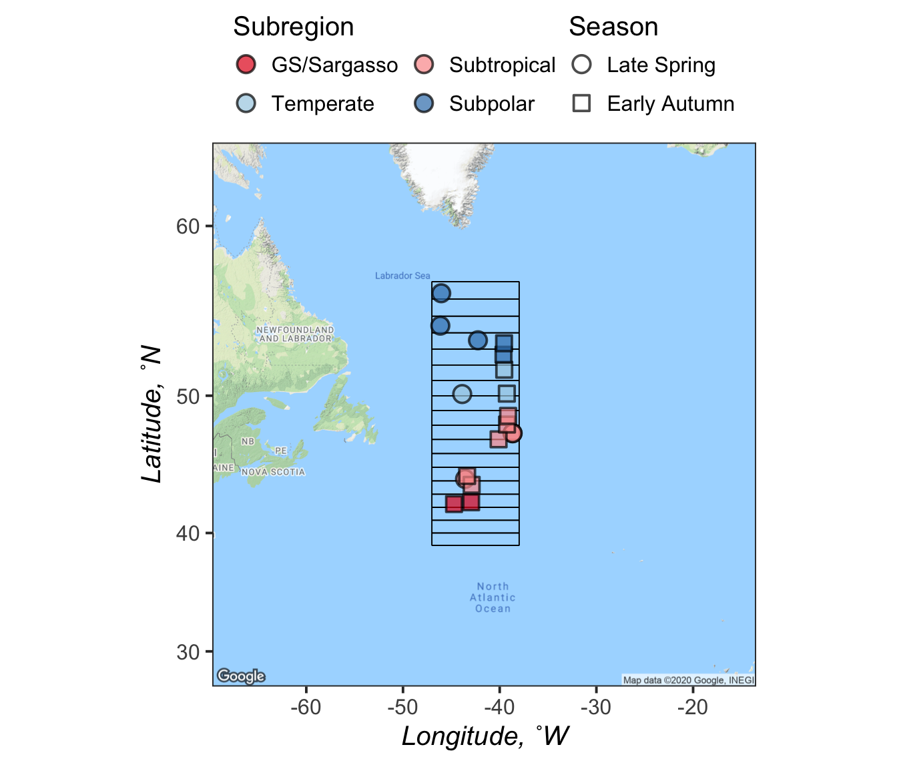

Cruise Map
================
Nicholas Baetge
2/7/2020

# Intro

This document highlights how the cruise map was rendered.

# Import Data

``` r
#import the station coordinates for N3 and N4
station.coord <- read_rds("~/Google Drive File Stream/Shared drives/NAAMES_Carlson/DATA/FINAL/MANUSCRIPT_DATA/Export_MS/Output/processed_bf.2.2020.rds") %>% 
  select(Cruise, Station, Latitude, Longitude, degree_bin, Subregion, Season) %>% 
  group_by(Cruise, Station) %>% 
  mutate(mean_lat = mean(Latitude),
         mean_lon = mean(Longitude)) %>% 
  select(Cruise, Season, Station, Subregion, mean_lat, mean_lon,  degree_bin) %>%
  distinct() %>% 
  mutate(degree_bin = round(mean_lat)) %>% 
  filter(Cruise %in% c("AT38", "AT34")) 

lon <-  station.coord$mean_lon
lat <-  station.coord$mean_lat
pts <-  cbind.data.frame(lon, lat)
```

| Cruise | Season       | Station | Subregion   | mean\_lat |  mean\_lon | degree\_bin |
| :----- | :----------- | ------: | :---------- | --------: | ---------: | ----------: |
| AT34   | Late Spring  |     0.0 | Subpolar    |  54.43200 | \-46.13800 |          54 |
| AT34   | Late Spring  |     1.0 | Subpolar    |  56.33500 | \-46.04650 |          56 |
| AT34   | Late Spring  |     2.0 | Subpolar    |  53.54300 | \-42.24950 |          54 |
| AT34   | Late Spring  |     3.0 | Temperate   |  50.10900 | \-43.87700 |          50 |
| AT34   | Late Spring  |     4.0 | Subtropical |  47.44027 | \-38.67034 |          47 |
| AT34   | Late Spring  |     4.0 | Subtropical |  47.44027 | \-38.67034 |          47 |
| AT34   | Late Spring  |     5.0 | Subtropical |  44.14700 | \-43.58500 |          44 |
| AT38   | Early Autumn |     0.0 | GS/Sargasso |  42.25400 | \-44.72100 |          42 |
| AT38   | Early Autumn |     1.0 | GS/Sargasso |  42.39100 | \-42.95400 |          42 |
| AT38   | Early Autumn |     1.5 | Subtropical |  43.70600 | \-42.90100 |          44 |
| AT38   | Early Autumn |     2.0 | Subtropical |  44.36571 | \-43.36823 |          44 |
| AT38   | Early Autumn |     3.0 | Subtropical |  47.01343 | \-40.11537 |          47 |
| AT38   | Early Autumn |     3.5 | Subtropical |  48.04600 | \-39.24600 |          48 |
| AT38   | Early Autumn |     4.0 | Subtropical |  48.64014 | \-39.13157 |          49 |
| AT38   | Early Autumn |     4.5 | Temperate   |  50.13600 | \-39.26200 |          50 |
| AT38   | Early Autumn |     5.0 | Temperate   |  51.69586 | \-39.52986 |          52 |
| AT38   | Early Autumn |     5.5 | Subpolar    |  52.64700 | \-39.60600 |          53 |
| AT38   | Early Autumn |     6.0 | Subpolar    |  53.35839 | \-39.54711 |          53 |

NAAMES 3 and 4 Station Coordinates

# Plot map

``` r
#define center of map
ll_mean = c(mean(pts$lon, na.rm=T), mean(pts$lat, na.rm = T))

#get raster background map data --- need to acquire google maps api

ggm = get_map(location = ll_mean,  maptype = "terrain", source = "google", zoom=4, color="color")

#create map
gg = ggmap(ggm) + 
  #adding bin demarcations
  geom_segment(aes(x = -38, xend = -47, y = 39, yend = 39)) +
  geom_segment(aes(x = -38, xend = -47, y = 40, yend = 40)) +
  geom_segment(aes(x = -38, xend = -47, y = 41, yend = 41)) +
  geom_segment(aes(x = -38, xend = -47, y = 42, yend = 42)) +
  geom_segment(aes(x = -38, xend = -47, y = 43, yend = 43)) +
  geom_segment(aes(x = -38, xend = -47, y = 44, yend = 44)) +
  geom_segment(aes(x = -38, xend = -47, y = 45, yend = 45)) +
  geom_segment(aes(x = -38, xend = -47, y = 46, yend = 46)) +
  geom_segment(aes(x = -38, xend = -47, y = 47, yend = 47)) +
  geom_segment(aes(x = -38, xend = -47, y = 48, yend = 48)) +
  geom_segment(aes(x = -38, xend = -47, y = 49, yend = 49)) +
  geom_segment(aes(x = -38, xend = -47, y = 50, yend = 50)) +
  geom_segment(aes(x = -38, xend = -47, y = 51, yend = 51)) +
  geom_segment(aes(x = -38, xend = -47, y = 52, yend = 52)) +
  geom_segment(aes(x = -38, xend = -47, y = 53, yend = 53)) +
  geom_segment(aes(x = -38, xend = -47, y = 54, yend = 54)) +
  geom_segment(aes(x = -38, xend = -47, y = 55, yend = 55)) +
  geom_segment(aes(x = -38, xend = -47, y = 56, yend = 56)) +
  geom_segment(aes(x = -38, xend = -47, y = 57, yend = 57)) +
  geom_segment(aes(x = -38, xend = -38, y = 39, yend = 57)) +
  geom_segment(aes(x = -47, xend = -47, y = 39, yend = 57)) +
  geom_point(data = station.coord, aes(x = mean_lon, y = mean_lat, shape = Season, fill = Subregion), color = " black", size = 8, alpha = 0.7, stroke = 2) +
  scale_fill_manual(values = custom.colors) + 
  scale_shape_manual(values = c(21,22,23,24)) +
  labs(y = expression(italic("Latitude, ˚N")),  x = expression(italic("Longitude, ˚W"))) +
  guides(fill = guide_legend(override.aes = list(shape = 21),
                         nrow = 2, byrow = T, title.position = "top"),
        shape = guide_legend(nrow = 2, byrow = T, title.position = "top")) +
  custom_theme()  +
  theme(legend.key.size = unit(2, 'lines'))

gg
```



``` r
#saveRDS(gg, file = "~/Google Drive File Stream/Shared Drives/NAAMES_Carlson/DATA/FINAL/MANUSCRIPT_DATA/Export_MS/Figures/Cruise_Map.rds")

#ggsave("Figure1a.jpg", gg, device = "jpg",  width = 14, height = 12, path ="~/Desktop/Export_MS/Submission2/") 
```
