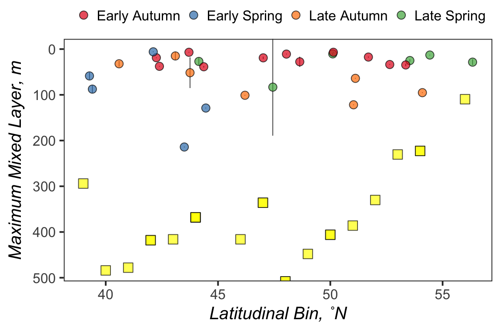
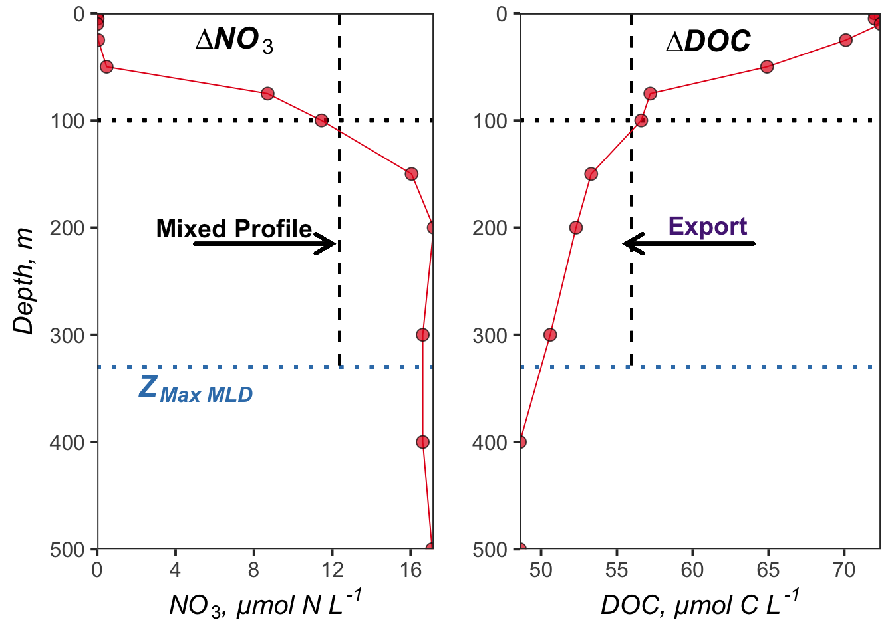
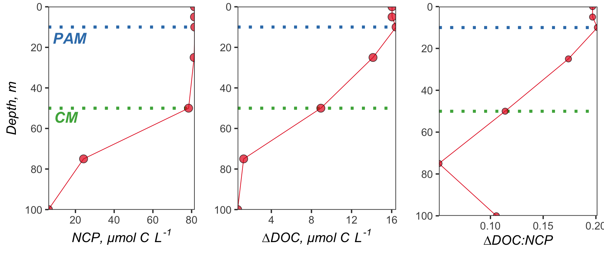
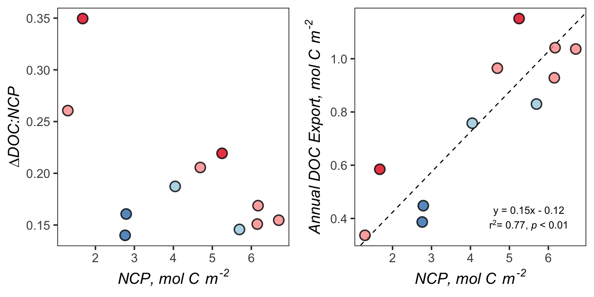
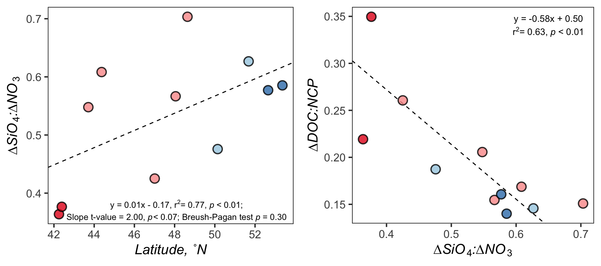

Export\_MS
================
Nicholas Baetge
1/30/2020

# Intro

This document is primarily used to plot data generated from the analyses
conducted for the NAAMES DOC export
manuscript.

# Import and Wrangle Data

``` r
processed_bf <- read_rds("~/Google Drive File Stream/Shared Drives/NAAMES_Carlson/DATA/FINAL/MANUSCRIPT_DATA/Export_MS/Output/processed_bf.2.2020.rds")

processed_export <- read_rds("~/Google Drive File Stream/Shared Drives/NAAMES_Carlson/DATA/FINAL/MANUSCRIPT_DATA/Export_MS/Output/processed_export.rds") 

processed_export$Season <- factor(processed_export$Season, levels = levels)

processed_export.spr <- processed_export %>% 
  filter(Season %in% c("Late Spring")) 
 

processed_export.aut <- processed_export %>% 
  filter(Season %in% c("Early Autumn"))  
```

## Data for Regressions

We’ll use station/day averages for any model regressions we conduct.

``` r
regression.means <- processed_export %>% 
  select(Cruise:Subregion, NCP_mol_100, NCP_mol_cm, NCP_mol_phy, int_delta_DOC_100, int_delta_DOC_100_maxmld,int_delta_DOC_phy, int_delta_DOC_cm, doc_ncp_100:si_ncp_100, int_Pro_cm_vol:int_Nano_phy_vol) %>%
  distinct() %>% 
  group_by(Cruise, Station) %>% 
  mutate_at(vars(NCP_mol_100:int_Nano_phy_vol), mean, na.rm = T) %>% 
  distinct() %>% 
  ungroup()
regression.means[ is.na(regression.means) ] <- NA


regression.means.spr <- regression.means %>% 
  filter(Season == "Late Spring")

regression.means.aut <- regression.means %>% 
  filter(Season == "Early Autumn")
```

# Tables

## Table 1. ARGO Observations

See ARGO.Rmd
document

## Table 2. Early Autumn

| Station | ave\_lat | ave\_lon | Bin | Subregion   | ave\_date  | Max\_MLD | ave\_chlmax | sd\_chlmax | ave\_pmax | sd\_pmax | Mixed\_N | Mixed\_DOC | Mixed\_Si | Delta\_N |  NCP | DOC\_NCP | Delta\_DOC | Delta\_DOC\_mz | Delta\_Si | Si\_N | Si\_NCP |
| ------: | -------: | -------: | --: | :---------- | :--------- | -------: | ----------: | ---------: | --------: | -------: | -------: | ---------: | --------: | -------: | ---: | -------: | ---------: | -------------: | --------: | ----: | ------: |
|     0.0 |    42.25 |  \-44.72 |  42 | GS/Sargasso | 2017-09-04 |    418.0 |          75 |          0 |        50 |        0 |     8.49 |      56.10 |      3.66 |     0.80 | 5.25 |     0.22 |       1.15 |           1.15 |      0.29 |  0.36 |    0.06 |
|     1.0 |    42.39 |  \-42.95 |  42 | GS/Sargasso | 2017-09-04 |    418.0 |          75 |          0 |        50 |        0 |     3.83 |      54.70 |      1.72 |     0.25 | 1.67 |     0.35 |       0.58 |           0.58 |      0.10 |  0.38 |    0.06 |
|     1.5 |    43.71 |  \-42.90 |  44 | Subtropical | 2017-09-05 |    368.0 |          50 |          0 |        40 |        0 |    10.08 |      53.56 |      5.27 |     0.71 | 4.69 |     0.21 |       0.96 |           0.96 |      0.39 |  0.55 |    0.08 |
|     2.0 |    44.37 |  \-43.37 |  44 | Subtropical | 2017-09-06 |    368.0 |          38 |         13 |         0 |        0 |    13.14 |      55.89 |      7.75 |     0.94 | 6.17 |     0.17 |       1.04 |           1.04 |      0.57 |  0.61 |    0.09 |
|     3.0 |    47.01 |  \-40.11 |  47 | Subtropical | 2017-09-08 |    336.0 |          34 |          8 |        16 |        8 |     4.65 |      54.25 |      2.14 |     0.20 | 1.29 |     0.26 |       0.34 |           0.34 |      0.08 |  0.43 |    0.06 |
|     3.5 |    48.05 |  \-39.25 |  48 | Subtropical | 2017-09-09 |    508.0 |          25 |          0 |        25 |        0 |    13.87 |      51.25 |      7.42 |     1.02 | 6.70 |     0.15 |       1.04 |           1.04 |      0.58 |  0.57 |    0.09 |
|     4.0 |    48.64 |  \-39.13 |  49 | Subtropical | 2017-09-10 |    448.0 |          39 |         13 |        16 |        8 |    13.09 |      51.57 |      8.30 |     0.93 | 6.15 |     0.15 |       0.93 |           0.93 |      0.66 |  0.70 |    0.11 |
|     4.5 |    50.14 |  \-39.26 |  50 | Temperate   | 2017-09-11 |    406.0 |          25 |          0 |         0 |        0 |    10.69 |      52.39 |      4.73 |     0.61 | 4.05 |     0.19 |       0.76 |           0.76 |      0.29 |  0.48 |    0.07 |
|     5.0 |    51.68 |  \-39.51 |  52 | Temperate   | 2017-09-12 |    330.0 |          50 |          0 |        10 |        0 |    12.37 |      55.96 |      7.47 |     0.86 | 5.70 |     0.15 |       0.83 |           0.83 |      0.54 |  0.63 |    0.09 |
|     5.5 |    52.65 |  \-39.61 |  53 | Subpolar    | 2017-09-13 |    230.5 |          25 |          0 |        10 |        9 |    12.99 |      54.43 |      7.34 |     0.42 | 2.79 |     0.16 |       0.45 |           0.45 |      0.24 |  0.58 |    0.09 |
|     6.0 |    53.36 |  \-39.55 |  53 | Subpolar    | 2017-09-14 |    230.5 |          18 |          7 |        10 |        9 |    12.66 |      52.72 |      6.68 |     0.42 | 2.76 |     0.14 |       0.39 |           0.39 |      0.24 |  0.59 |    0.09 |

Early
Autumn

## Table 3. Late Spring

| Station | ave\_lat | ave\_lon | Bin | Subregion   | ave\_date  | Max\_MLD | ave\_chlmax | sd\_chlmax | ave\_pmax | sd\_pmax | Mixed\_N | Mixed\_DOC | Mixed\_Si | Delta\_N |  NCP | DOC\_NCP | Delta\_DOC | Delta\_Si | Si\_N | Si\_NCP |
| ------: | -------: | -------: | --: | :---------- | :--------- | -------: | ----------: | ---------: | --------: | -------: | -------: | ---------: | --------: | -------: | ---: | -------: | ---------: | --------: | ----: | ------: |
|       5 |    44.15 |  \-43.58 |  44 | Subtropical | 2016-05-29 |    368.0 |          25 |          0 |         0 |        0 |    11.61 |      54.73 |      6.51 |     0.81 | 5.35 |     0.04 |       0.23 |      0.56 |  0.69 |    0.11 |
|       4 |    47.44 |  \-38.67 |  48 | Subtropical | 2016-05-25 |    508.0 |          20 |         13 |         3 |        4 |    13.87 |      51.25 |      7.42 |     0.90 | 5.92 |     0.04 |       0.21 |      0.63 |  0.70 |    0.11 |
|       3 |    50.11 |  \-43.88 |  50 | Temperate   | 2016-05-22 |    406.0 |          18 |          8 |         0 |        0 |    10.69 |      52.39 |      4.73 |     0.31 | 2.06 |     0.14 |       0.29 |      0.04 |  0.12 |    0.02 |
|       0 |    54.43 |  \-46.14 |  54 | Subpolar    | 2016-05-17 |    222.7 |          25 |          0 |         0 |        0 |    14.78 |      49.76 |      8.03 |     0.13 | 0.89 |     0.19 |       0.17 |      0.04 |  0.30 |    0.04 |
|       2 |    53.54 |  \-42.25 |  54 | Subpolar    | 2016-05-20 |    222.7 |          10 |          0 |         0 |        0 |    12.84 |      50.36 |      7.47 |     0.22 | 1.48 |     0.11 |       0.17 |      0.06 |  0.27 |    0.04 |
|       1 |    56.34 |  \-46.05 |  56 | Subpolar    | 2016-05-18 |    109.6 |          18 |          8 |         0 |        0 |    13.23 |      51.19 |      7.96 |     0.01 | 0.03 |     0.16 |       0.01 |      0.00 |  0.32 |    0.05 |

Late
Spring

## Supplemental Table 1. Integrations

| Season       | Station | ave\_lat | ave\_lon | NCP\_100 | NCP\_CM | NCP\_PM | Delta\_DOC\_100 | Delta\_DOC\_CM | Delta\_DOC\_PM | DOC\_NCP\_100 | DOC\_NCP\_CM | DOC\_NCP\_PM |
| :----------- | ------: | -------: | -------: | -------: | ------: | ------: | --------------: | -------------: | -------------: | ------------: | -----------: | -----------: |
| Late Spring  |     5.0 |    44.15 |  \-43.58 |     5.35 |    1.87 |      NA |            0.23 |           0.16 |             NA |          0.04 |         0.08 |           NA |
| Late Spring  |     4.0 |    47.44 |  \-38.67 |     5.92 |    1.23 |    0.18 |            0.21 |           0.05 |           0.01 |          0.04 |         0.04 |         0.04 |
| Late Spring  |     3.0 |    50.11 |  \-43.88 |     2.06 |    0.62 |      NA |            0.29 |           0.08 |             NA |          0.14 |         0.13 |           NA |
| Late Spring  |     2.0 |    53.54 |  \-42.25 |     1.48 |    0.37 |      NA |            0.17 |           0.05 |             NA |          0.11 |         0.15 |           NA |
| Late Spring  |     0.0 |    54.43 |  \-46.14 |     0.89 |    0.58 |      NA |            0.17 |           0.09 |             NA |          0.19 |         0.15 |           NA |
| Late Spring  |     1.0 |    56.34 |  \-46.05 |     0.03 |    0.10 |      NA |            0.01 |           0.02 |             NA |          0.16 |         0.19 |           NA |
| Early Autumn |     0.0 |    42.25 |  \-44.72 |     5.25 |    4.20 |    2.80 |            1.15 |           1.01 |           0.72 |          0.22 |         0.24 |         0.26 |
| Early Autumn |     1.0 |    42.39 |  \-42.95 |     1.67 |    1.61 |    1.25 |            0.58 |           0.56 |           0.46 |          0.35 |         0.34 |         0.37 |
| Early Autumn |     1.5 |    43.71 |  \-42.90 |     4.69 |    3.19 |    2.62 |            0.96 |           0.81 |           0.70 |          0.21 |         0.25 |         0.27 |
| Early Autumn |     2.0 |    44.37 |  \-43.37 |     6.17 |    3.26 |      NA |            1.04 |           0.64 |             NA |          0.17 |         0.20 |           NA |
| Early Autumn |     3.0 |    47.01 |  \-40.11 |     1.29 |    0.96 |    0.48 |            0.34 |           0.35 |           0.20 |          0.26 |         0.36 |         0.41 |
| Early Autumn |     3.5 |    48.05 |  \-39.25 |     6.70 |    2.28 |    2.28 |            1.04 |           0.45 |           0.45 |          0.15 |         0.20 |         0.20 |
| Early Autumn |     4.0 |    48.64 |  \-39.13 |     6.15 |    3.31 |    1.38 |            0.93 |           0.62 |           0.26 |          0.15 |         0.19 |         0.19 |
| Early Autumn |     4.5 |    50.14 |  \-39.26 |     4.05 |    1.74 |      NA |            0.76 |           0.38 |             NA |          0.19 |         0.22 |           NA |
| Early Autumn |     5.0 |    51.68 |  \-39.51 |     5.70 |    4.03 |    0.82 |            0.83 |           0.68 |           0.16 |          0.15 |         0.17 |         0.20 |
| Early Autumn |     5.5 |    52.65 |  \-39.61 |     2.79 |    2.12 |    0.85 |            0.45 |           0.29 |           0.13 |          0.16 |         0.14 |         0.15 |
| Early Autumn |     6.0 |    53.36 |  \-39.55 |     2.76 |    1.31 |    0.73 |            0.39 |           0.18 |           0.10 |          0.14 |         0.14 |         0.14 |

Integration Comparisons

## Supplemental Table 2. ∆DOC:NCP v Phytoplankton

``` r
si_t2_data <- regression.means.aut %>% 
  select(Subregion, doc_ncp_cm, doc_ncp_phy, int_Syn_cm_vol, int_Syn_phy_vol, int_Pico_cm_vol, int_Pico_phy_vol, int_Nano_cm_vol, int_Nano_phy_vol  ) %>% 
  distinct()
lmodel2(doc_ncp_cm ~ int_Syn_cm_vol, data = si_t2_data, nperm = 99)
```

    ## 
    ## Model II regression
    ## 
    ## Call: lmodel2(formula = doc_ncp_cm ~ int_Syn_cm_vol, data = si_t2_data,
    ## nperm = 99)
    ## 
    ## n = 10   r = -0.292035   r-square = 0.08528445 
    ## Parametric P-values:   2-tailed = 0.4129241    1-tailed = 0.2064621 
    ## Angle between the two OLS regression lines = 4.146209e-07 degrees
    ## 
    ## Permutation tests of OLS, MA, RMA slopes: 1-tailed, tail corresponding to sign
    ## A permutation test of r is equivalent to a permutation test of the OLS slope
    ## P-perm for SMA = NA because the SMA slope cannot be tested
    ## 
    ## Regression results
    ##   Method Intercept         Slope Angle (degrees) P-perm (1-tailed)
    ## 1    OLS 0.2542941 -6.747025e-10   -3.865761e-08              0.22
    ## 2     MA 0.2308279  0.000000e+00    0.000000e+00              0.99
    ## 3    SMA 0.3111819 -2.310348e-09   -1.323732e-07                NA
    ## 
    ## Confidence intervals
    ##   Method 2.5%-Intercept 97.5%-Intercept    2.5%-Slope   97.5%-Slope
    ## 1    OLS      0.1714037       0.3371844 -2.476208e-09  1.126803e-09
    ## 2     MA      0.1681715       0.2934843 -1.801505e-09  1.801505e-09
    ## 3    SMA      0.2700665       0.3953793 -4.731203e-09 -1.128193e-09
    ## 
    ## Eigenvalues: 1.008252e+15 0.004922774 
    ## 
    ## H statistic used for computing C.I. of MA: 3.245421e-18

``` r
lmodel2(doc_ncp_phy ~ int_Syn_phy_vol, data = si_t2_data, nperm = 99) 
```

    ## 
    ## Model II regression
    ## 
    ## Call: lmodel2(formula = doc_ncp_phy ~ int_Syn_phy_vol, data =
    ## si_t2_data, nperm = 99)
    ## 
    ## n = 8   r = -0.4912783   r-square = 0.2413544 
    ## Parametric P-values:   2-tailed = 0.2163367    1-tailed = 0.1081683 
    ## Angle between the two OLS regression lines = 2.963871e-07 degrees
    ## 
    ## Permutation tests of OLS, MA, RMA slopes: 1-tailed, tail corresponding to sign
    ## A permutation test of r is equivalent to a permutation test of the OLS slope
    ## P-perm for SMA = NA because the SMA slope cannot be tested
    ## 
    ## Regression results
    ##   Method Intercept         Slope Angle (degrees) P-perm (1-tailed)
    ## 1    OLS 0.3057485 -1.645708e-09   -9.429214e-08              0.13
    ## 2     MA 0.2537379  0.000000e+00    0.000000e+00              0.98
    ## 3    SMA 0.3596059 -3.349849e-09   -1.919322e-07                NA
    ## 
    ## Confidence intervals
    ##   Method 2.5%-Intercept 97.5%-Intercept    2.5%-Slope   97.5%-Slope
    ## 1    OLS      0.1860760       0.4254211 -4.560365e-09  1.268949e-09
    ## 2     MA      0.1616236       0.3458521 -2.914657e-09  2.914657e-09
    ## 3    SMA      0.3019556       0.4861841 -7.355007e-09 -1.525694e-09
    ## 
    ## Eigenvalues: 7.851784e+14 0.006684329 
    ## 
    ## H statistic used for computing C.I. of MA: 8.495224e-18

``` r
lmodel2(doc_ncp_cm ~ int_Pico_cm_vol, data = si_t2_data, nperm = 99)
```

    ## 
    ## Model II regression
    ## 
    ## Call: lmodel2(formula = doc_ncp_cm ~ int_Pico_cm_vol, data =
    ## si_t2_data, nperm = 99)
    ## 
    ## n = 10   r = -0.6059131   r-square = 0.3671307 
    ## Parametric P-values:   2-tailed = 0.06335336    1-tailed = 0.03167668 
    ## Angle between the two OLS regression lines = 6.330844e-07 degrees
    ## 
    ## Permutation tests of OLS, MA, RMA slopes: 1-tailed, tail corresponding to sign
    ## A permutation test of r is equivalent to a permutation test of the OLS slope
    ## P-perm for SMA = NA because the SMA slope cannot be tested
    ## 
    ## Regression results
    ##   Method Intercept         Slope Angle (degrees) P-perm (1-tailed)
    ## 1    OLS 0.2804148 -6.409816e-09   -3.672554e-07              0.02
    ## 2     MA 0.2308279  0.000000e+00    0.000000e+00              0.96
    ## 3    SMA 0.3126662 -1.057877e-08   -6.061190e-07                NA
    ## 
    ## Confidence intervals
    ##   Method 2.5%-Intercept 97.5%-Intercept    2.5%-Slope   97.5%-Slope
    ## 1    OLS      0.2107368       0.3500927 -1.327113e-08  4.514988e-10
    ## 2     MA      0.1777482       0.2839076 -6.861315e-09  6.861315e-09
    ## 3    SMA      0.2752928       0.3814523 -1.947036e-08 -5.747732e-09
    ## 
    ## Eigenvalues: 4.808984e+13 0.003405947 
    ## 
    ## H statistic used for computing C.I. of MA: 4.707765e-17

``` r
lmodel2(doc_ncp_phy ~ int_Pico_phy_vol, data = si_t2_data, nperm = 99)
```

    ## 
    ## Model II regression
    ## 
    ## Call: lmodel2(formula = doc_ncp_phy ~ int_Pico_phy_vol, data =
    ## si_t2_data, nperm = 99)
    ## 
    ## n = 8   r = -0.7526563   r-square = 0.5664916 
    ## Parametric P-values:   2-tailed = 0.03115983    1-tailed = 0.01557992 
    ## Angle between the two OLS regression lines = 4.011748e-07 degrees
    ## 
    ## Permutation tests of OLS, MA, RMA slopes: 1-tailed, tail corresponding to sign
    ## A permutation test of r is equivalent to a permutation test of the OLS slope
    ## P-perm for SMA = NA because the SMA slope cannot be tested
    ## 
    ## Regression results
    ##   Method Intercept         Slope Angle (degrees) P-perm (1-tailed)
    ## 1    OLS 0.3274874 -9.149701e-09   -5.242392e-07              0.01
    ## 2     MA 0.3137920 -7.450581e-09   -4.268868e-07              0.15
    ## 3    SMA 0.3517235 -1.215654e-08   -6.965187e-07                NA
    ## 
    ## Confidence intervals
    ##   Method 2.5%-Intercept 97.5%-Intercept    2.5%-Slope   97.5%-Slope
    ## 1    OLS      0.2409510       0.4140238 -1.714531e-08 -1.154090e-09
    ## 2     MA      0.2493448       0.3782391 -1.544619e-08  5.450298e-10
    ## 3    SMA      0.3065708       0.4354652 -2.254592e-08 -6.554694e-09
    ## 
    ## Eigenvalues: 5.96209e+13 0.003819587 
    ## 
    ## H statistic used for computing C.I. of MA: 6.392979e-17

``` r
lmodel2(doc_ncp_cm ~ int_Nano_cm_vol, data = si_t2_data, nperm = 99)
```

    ## 
    ## Model II regression
    ## 
    ## Call: lmodel2(formula = doc_ncp_cm ~ int_Nano_cm_vol, data =
    ## si_t2_data, nperm = 99)
    ## 
    ## n = 10   r = -0.6074148   r-square = 0.3689528 
    ## Parametric P-values:   2-tailed = 0.06252425    1-tailed = 0.03126213 
    ## Angle between the two OLS regression lines = 2.792019e-06 degrees
    ## 
    ## Permutation tests of OLS, MA, RMA slopes: 1-tailed, tail corresponding to sign
    ## A permutation test of r is equivalent to a permutation test of the OLS slope
    ## P-perm for SMA = NA because the SMA slope cannot be tested
    ## 
    ## Regression results
    ##   Method Intercept         Slope Angle (degrees) P-perm (1-tailed)
    ## 1    OLS 0.2782817 -2.849081e-08   -1.632403e-06              0.02
    ## 2     MA 0.2804661 -2.980232e-08   -1.707547e-06              0.02
    ## 3    SMA 0.3089521 -4.690502e-08   -2.687460e-06                NA
    ## 
    ## Confidence intervals
    ##   Method 2.5%-Intercept 97.5%-Intercept    2.5%-Slope   97.5%-Slope
    ## 1    OLS      0.2105186       0.3460448 -5.886924e-08  1.887627e-09
    ## 2     MA      0.2298683       0.3310640 -6.018075e-08  5.761099e-10
    ## 3    SMA      0.2733082       0.3745038 -8.626162e-08 -2.550475e-08
    ## 
    ## Eigenvalues: 2.446161e+12 0.003396141 
    ## 
    ## H statistic used for computing C.I. of MA: 9.228492e-16

``` r
lmodel2(doc_ncp_phy ~ int_Nano_phy_vol, data = si_t2_data, nperm = 99)
```

    ## 
    ## Model II regression
    ## 
    ## Call: lmodel2(formula = doc_ncp_phy ~ int_Nano_phy_vol, data =
    ## si_t2_data, nperm = 99)
    ## 
    ## n = 8   r = -0.6722885   r-square = 0.4519719 
    ## Parametric P-values:   2-tailed = 0.06777809    1-tailed = 0.03388904 
    ## Angle between the two OLS regression lines = 2.426623e-06 degrees
    ## 
    ## Permutation tests of OLS, MA, RMA slopes: 1-tailed, tail corresponding to sign
    ## A permutation test of r is equivalent to a permutation test of the OLS slope
    ## P-perm for SMA = NA because the SMA slope cannot be tested
    ## 
    ## Regression results
    ##   Method Intercept         Slope Angle (degrees) P-perm (1-tailed)
    ## 1    OLS 0.3157872 -3.492917e-08   -2.001294e-06              0.03
    ## 2     MA 0.3166063 -3.539026e-08   -2.027712e-06              0.03
    ## 3    SMA 0.3460335 -5.195562e-08   -2.976838e-06                NA
    ## 
    ## Confidence intervals
    ##   Method 2.5%-Intercept 97.5%-Intercept    2.5%-Slope   97.5%-Slope
    ## 1    OLS      0.2215816       0.4099928 -7.335088e-08  3.492541e-09
    ## 2     MA      0.2483527       0.3848599 -7.381197e-08  3.031451e-09
    ## 3    SMA      0.3002756       0.4367827 -1.030407e-07 -2.619728e-08
    ## 
    ## Eigenvalues: 3.264027e+12 0.004828606 
    ## 
    ## H statistic used for computing C.I. of MA: 1.476228e-15

# Figure 1. Cruise Map & Floats

See Cruise\_Map.Rmd and ARGO.Rmd
documents

# Figure 2. MLD Comparison



# Figure 3. Early Autumn Profiles



# Figure 4. ∆DOC, NCP, DOC:NCP Profiles



# Figure 5. DOC:NCP Boxplots

``` r
f4_data <- regression.means %>% 
  select(Season, doc_ncp_100) %>% 
  distinct()
f4_test <- t.test(doc_ncp_100 ~ Season, data = f4_data)
```

| Test statistic |  df   |  P value   | Alternative hypothesis |
| :------------: | :---: | :--------: | :--------------------: |
|    \-2.496     | 10.32 | 0.03098 \* |       two.sided        |

Welch Two Sample t-test: `doc_ncp_100` by `Season` (continued below)

| mean in group Late Spring | mean in group Early Autumn |
| :-----------------------: | :------------------------: |
|          0.1144           |           0.1948           |


# Figure 6. DOC:NCP v NCP and Export v NCP

``` r
f5_data <- regression.means.aut %>% 
  select(Subregion,  doc_ncp_100, int_delta_DOC_100_maxmld,NCP_mol_100) %>% 
  distinct()

f5b <- lmodel2(int_delta_DOC_100_maxmld ~ NCP_mol_100, data = f5_data, nperm = 99)
```

    ## 
    ## Model II regression
    ## 
    ## Call: lmodel2(formula = int_delta_DOC_100_maxmld ~ NCP_mol_100, data =
    ## f5_data, nperm = 99)
    ## 
    ## n = 11   r = 0.8798966   r-square = 0.774218 
    ## Parametric P-values:   2-tailed = 0.0003540031    1-tailed = 0.0001770015 
    ## Angle between the two OLS regression lines = 2.169109 degrees
    ## 
    ## Permutation tests of OLS, MA, RMA slopes: 1-tailed, tail corresponding to sign
    ## A permutation test of r is equivalent to a permutation test of the OLS slope
    ## P-perm for SMA = NA because the SMA slope cannot be tested
    ## 
    ## Regression results
    ##   Method Intercept     Slope Angle (degrees) P-perm (1-tailed)
    ## 1    OLS 0.1993005 0.1328397        7.566851              0.01
    ## 2     MA 0.1964023 0.1335148        7.604858              0.01
    ## 3    SMA 0.1214603 0.1509719        8.585219                NA
    ## 
    ## Confidence intervals
    ##   Method 2.5%-Intercept 97.5%-Intercept 2.5%-Slope 97.5%-Slope
    ## 1    OLS    -0.05289304       0.4514940 0.07874651   0.1869328
    ## 2     MA    -0.03901020       0.4284759 0.07945508   0.1883522
    ## 3    SMA    -0.15110287       0.3133317 0.10627701   0.2144633
    ## 
    ## Eigenvalues: 3.702285 0.01839422 
    ## 
    ## H statistic used for computing C.I. of MA: 0.002853255



# Figure 7. Si:N

``` r
f6_data <- regression.means.aut %>% 
  select(Subregion, si_n_100, ave_lat, doc_ncp_100) %>% 
  distinct()

f6a <- lm(si_n_100 ~ ave_lat, data = f6_data)
```

    ## 
    ## Call:
    ## lm(formula = si_n_100 ~ ave_lat, data = f6_data)
    ## 
    ## Residuals:
    ##      Min       1Q   Median       3Q      Max 
    ## -0.09770 -0.08326 -0.02922  0.05435  0.15646 
    ## 
    ## Coefficients:
    ##              Estimate Std. Error t value Pr(>|t|)  
    ## (Intercept) -0.172742   0.354517  -0.487   0.6377  
    ## ave_lat      0.014796   0.007414   1.996   0.0771 .
    ## ---
    ## Signif. codes:  0 '***' 0.001 '**' 0.01 '*' 0.05 '.' 0.1 ' ' 1
    ## 
    ## Residual standard error: 0.09515 on 9 degrees of freedom
    ## Multiple R-squared:  0.3067, Adjusted R-squared:  0.2297 
    ## F-statistic: 3.982 on 1 and 9 DF,  p-value: 0.0771

    ## 
    ##  studentized Breusch-Pagan test
    ## 
    ## data:  f6a
    ## BP = 1.0692, df = 1, p-value = 0.3011

``` r
f6b <-  lmodel2(doc_ncp_100 ~ si_n_100, data = f6_data, nperm = 99)
```

    ## 
    ## Model II regression
    ## 
    ## Call: lmodel2(formula = doc_ncp_100 ~ si_n_100, data = f6_data, nperm =
    ## 99)
    ## 
    ## n = 11   r = -0.7981791   r-square = 0.6370899 
    ## Parametric P-values:   2-tailed = 0.003230797    1-tailed = 0.001615398 
    ## Angle between the two OLS regression lines = 11.18466 degrees
    ## 
    ## Permutation tests of OLS, MA, RMA slopes: 1-tailed, tail corresponding to sign
    ## A permutation test of r is equivalent to a permutation test of the OLS slope
    ## P-perm for SMA = NA because the SMA slope cannot be tested
    ## 
    ## Regression results
    ##   Method Intercept      Slope Angle (degrees) P-perm (1-tailed)
    ## 1    OLS 0.4423011 -0.4648342       -24.93062              0.02
    ## 2     MA 0.4695757 -0.5160633       -27.29660              0.02
    ## 3    SMA 0.5048767 -0.5823683       -30.21517                NA
    ## 
    ## Confidence intervals
    ##   Method 2.5%-Intercept 97.5%-Intercept 2.5%-Slope 97.5%-Slope
    ## 1    OLS      0.2988266       0.5857757 -0.7293788  -0.2002897
    ## 2     MA      0.3264382       0.6528808 -0.8603608  -0.2472117
    ## 3    SMA      0.3945228       0.6762116 -0.9041825  -0.3750934
    ## 
    ## Eigenvalues: 0.01457354 0.001166803 
    ## 
    ## H statistic used for computing C.I. of MA: 0.05379223



# Figure 8. ∆DOC:NCP v Pro

``` r
f7_data <- regression.means %>% 
  select(Subregion, doc_ncp_cm, int_Pro_cm_vol, doc_ncp_phy, int_Pro_phy_vol) %>% 
  distinct()

f7a <- lmodel2(doc_ncp_cm ~ int_Pro_cm_vol, data = f7_data , nperm = 99)
```

    ## 
    ## Model II regression
    ## 
    ## Call: lmodel2(formula = doc_ncp_cm ~ int_Pro_cm_vol, data = f7_data,
    ## nperm = 99)
    ## 
    ## n = 11   r = 0.7130593   r-square = 0.5084536 
    ## Parametric P-values:   2-tailed = 0.0137671    1-tailed = 0.006883548 
    ## Angle between the two OLS regression lines = 1.112887e-07 degrees
    ## 
    ## Permutation tests of OLS, MA, RMA slopes: 1-tailed, tail corresponding to sign
    ## A permutation test of r is equivalent to a permutation test of the OLS slope
    ## P-perm for SMA = NA because the SMA slope cannot be tested
    ## 
    ## Regression results
    ##   Method Intercept        Slope Angle (degrees) P-perm (1-tailed)
    ## 1    OLS 0.1544980 2.009164e-09    1.151166e-07              0.03
    ## 2     MA 0.2133675 0.000000e+00    0.000000e+00              0.98
    ## 3    SMA 0.1308084 2.817667e-09    1.614404e-07                NA
    ## 
    ## Confidence intervals
    ##   Method 2.5%-Intercept 97.5%-Intercept    2.5%-Slope  97.5%-Slope
    ## 1    OLS     0.09134932       0.2176466  5.195507e-10 3.498777e-09
    ## 2     MA     0.16972106       0.2570139 -1.489613e-09 1.489613e-09
    ## 3    SMA     0.07633470       0.1636275  1.697579e-09 4.676805e-09
    ## 
    ## Eigenvalues: 1.032478e+15 0.004029255 
    ## 
    ## H statistic used for computing C.I. of MA: 2.218947e-18

``` r
f7b <- lmodel2(doc_ncp_phy ~ int_Pro_phy_vol, data = f7_data, nperm = 99)
```

    ## 
    ## Model II regression
    ## 
    ## Call: lmodel2(formula = doc_ncp_phy ~ int_Pro_phy_vol, data = f7_data,
    ## nperm = 99)
    ## 
    ## n = 9   r = 0.6784584   r-square = 0.4603059 
    ## Parametric P-values:   2-tailed = 0.04453486    1-tailed = 0.02226743 
    ## Angle between the two OLS regression lines = 1.606972e-07 degrees
    ## 
    ## Permutation tests of OLS, MA, RMA slopes: 1-tailed, tail corresponding to sign
    ## A permutation test of r is equivalent to a permutation test of the OLS slope
    ## P-perm for SMA = NA because the SMA slope cannot be tested
    ## 
    ## Regression results
    ##   Method Intercept        Slope Angle (degrees) P-perm (1-tailed)
    ## 1    OLS 0.1528967 2.392128e-09    1.370588e-07              0.03
    ## 2     MA 0.2301448 0.000000e+00    0.000000e+00              0.99
    ## 3    SMA 0.1162865 3.525828e-09    2.020151e-07                NA
    ## 
    ## Confidence intervals
    ##   Method 2.5%-Intercept 97.5%-Intercept    2.5%-Slope  97.5%-Slope
    ## 1    OLS     0.05061006       0.2551834  7.714327e-11 4.707112e-09
    ## 2     MA     0.15538787       0.3049018 -2.314984e-09 2.314984e-09
    ## 3    SMA     0.01918100       0.1686949  1.902908e-09 6.532877e-09
    ## 
    ## Eigenvalues: 1.023147e+15 0.006864483 
    ## 
    ## H statistic used for computing C.I. of MA: 5.359153e-18


# Supplemental Figures. Profiles

See ProcessedExport.rMD document
