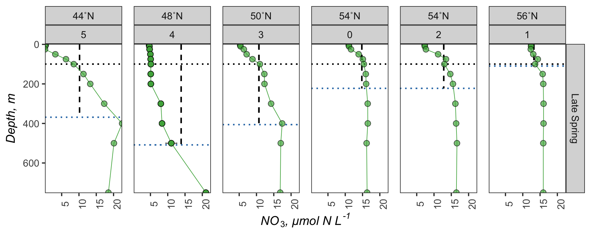
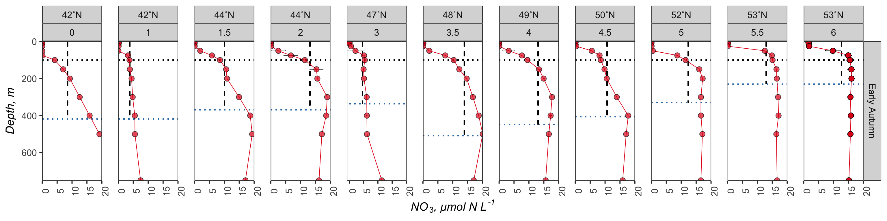
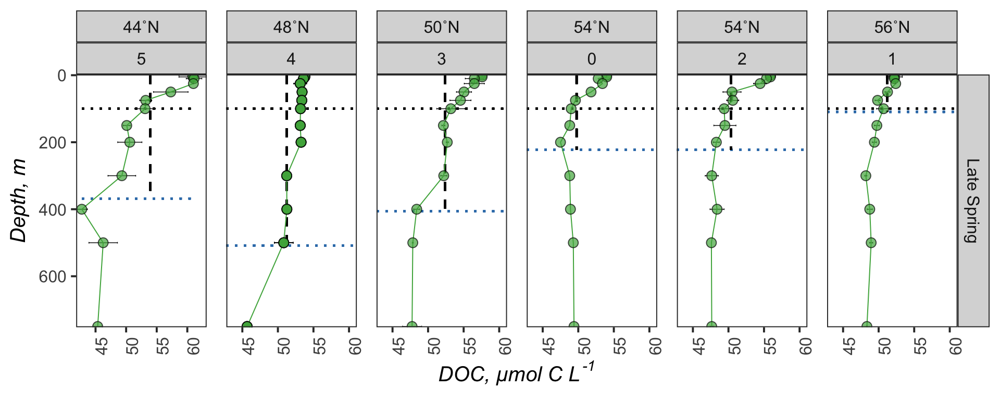
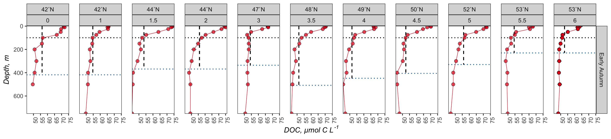
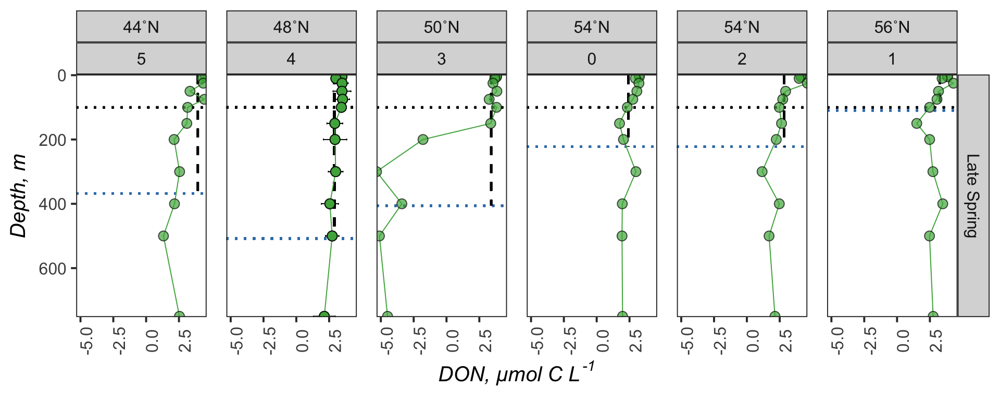
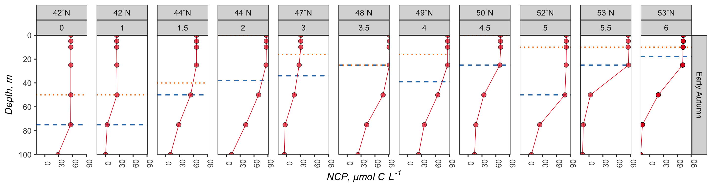
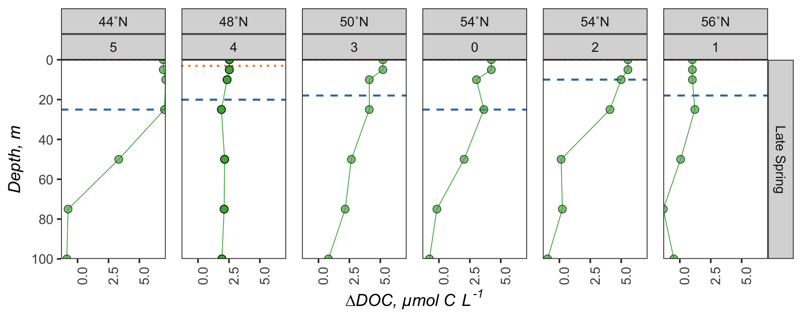
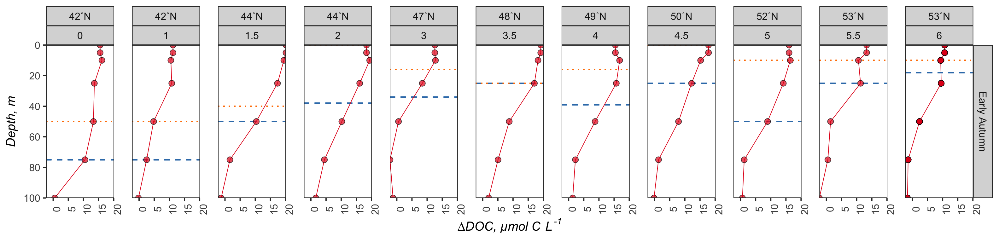
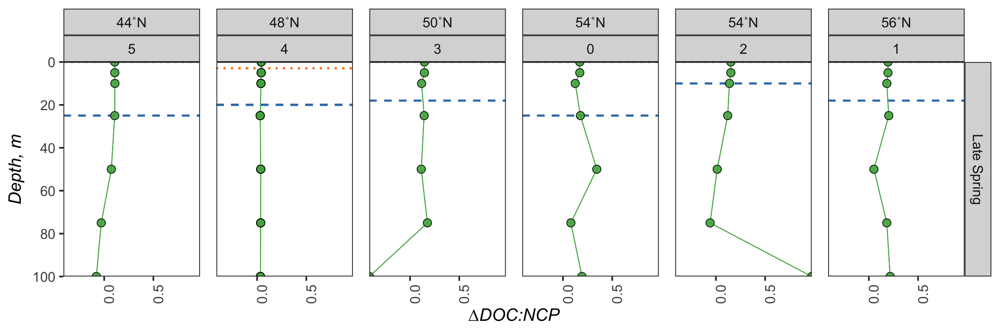

Processed Export
================
Nicholas Baetge
2/7/2020

# Intro

This document is shows how nitrate drawdown and NCP were calculated from
the processed bottle
file

# Import Data

``` r
processed_bf <-  read_rds("~/Google Drive File Stream/Shared drives/NAAMES_Carlson/DATA/FINAL/MANUSCRIPT_DATA/Export_MS/Output/processed_bf.2.2020.rds")
```

# Subset Nitrogen and Phytoplankton Data

``` r
#select nutrient and phytoplankton data for N2 and N3 
subset <- processed_bf %>% 
  #omitting CampCN 98 because only measurements at 5 m and below 1500 m were taken. the interpolated values for this cast were as a result, not reliable
  filter(Cruise %in% c("AT34", "AT38", "AT39-6"),
         !CampCN == 98) %>% 
  #the multiday N2S4 drifted from the 48˚Lat bin to the 47˚Lat bin, but was a lagrangian study (followed float), so we'll denote all casts within station 4 as being in the 48˚N bin
  mutate(degree_bin = ifelse(Cruise == "AT34" & Station == "4", 48, degree_bin),
         Max_MLD = ifelse(Cruise == "AT34" & Station == "4", 508, Max_MLD),) %>% 
  select(Cruise, Latitude, Longitude, Date, degree_bin, Station, Season, Subregion,  CampCN, 
         Chl_max, Phyto_max, Max_MLD,  Target_Z,  interp_DOC, interp_N_N, interp_NO2, interp_SiO4,  interp_Pro_Influx, interp_Syn_Influx, interp_Pico_Influx, interp_Nano_Influx, Density00, Density11) %>% 
  rename(Pro = interp_Pro_Influx, 
         Syn = interp_Syn_Influx, 
         Pico = interp_Pico_Influx, 
         Nano = interp_Nano_Influx) %>% 
  #add column that averages the density measurements
  mutate(p = (Density00 + Density11)/2) %>%
  distinct() %>% 
  #calculate nitrate for each cast, replacing values less than 0 with 0
  group_by(CampCN) %>% 
  mutate(N = interp_N_N - interp_NO2,
         N = ifelse(N < 0, 0, N),
         p5 = ifelse(Target_Z == 5, p, NA),
         p10 = ifelse(Target_Z == 10, p, NA),
         p = ifelse(Target_Z == 0, max(p5, na.rm = T) , p),
         p = ifelse(Target_Z == 0 | is.na(p), max(p10, na.rm = T) , p)) %>% 
  select(-c(interp_N_N, interp_NO2, Density00, Density11, p5, p10)) %>% 
  ungroup() 
```

# Create Composite Station Casts

## Average Chl Max and Phytoplankton Max

Since we’re interested in how stocks of nutrients vary over the 100 m,
chl max, and phytoplankton max depth horizons, we’ll need a station
average for each of the chl and phytoplankton max depths. We’ll
interpolate variables to those depths

``` r
ave_phyto <- subset %>%
  group_by(Cruise, Station) %>%
  mutate(ave_chlmax = mean(Chl_max), 
         sd_chlmax = sd(Chl_max),
         ave_pmax = mean(Phyto_max),
         sd_pmax = sd(Phyto_max)) %>% 
  mutate_at(vars(ave_chlmax:sd_pmax), round) %>% 
  ungroup()

#split the df by CampCN  
add_phyto.list <- split(ave_phyto, ave_phyto$CampCN)

#create a function to add an empty row to each cast, then add the max MLD to the Target Z column 
add.func <- function(morty){
  morty[nrow(morty) + 1,] <- NA
  morty$Target_Z[is.na(morty$Target_Z)] <- morty$ave_chlmax
  rick <- morty %>% 
    fill(., Cruise:Max_MLD, .direction = c("updown")) %>% 
    fill(., ave_chlmax:sd_pmax, .direction = c("updown")) %>% 
    arrange(CampCN, Target_Z)
  
  rick[nrow(rick) + 1,] <- NA
  rick$Target_Z[is.na(rick$Target_Z)] <- rick$ave_pmax
   schwifty <- rick %>% 
     fill(., Cruise:Max_MLD, .direction = c("updown")) %>% 
      fill(., ave_chlmax:sd_pmax, .direction = c("updown")) %>% 
    arrange(CampCN, Target_Z)

  }

#apply function to list 
added_phyto.list <- lapply(add_phyto.list, add.func)


#save the list as a data frame 
added_phyto.df <- plyr::ldply(added_phyto.list, data.frame) %>% 
  group_by(CampCN) %>% 
  distinct(., Target_Z, .keep_all = T) %>% 
  select(-.id) %>% 
  ungroup() %>% 
  filter(!Target_Z == "-Inf")


#split the data frame into lists based on the campaign cast number
to_interpolate.list <- split(added_phyto.df, added_phyto.df$CampCN)

#create a function that will linearly interpolate each VOI according to the depth intervals of the casts 
interpolate.func <- function(copper) {
to_interpolate.df <- copper %>% 
  select(Target_Z:ncol(.)) %>% 
  zoo(., order.by = .$Target_Z) 

interp_doc <- as.numeric(na.approx(to_interpolate.df$interp_DOC, na.rm = F))
interp_Si <- as.numeric(na.approx(to_interpolate.df$interp_SiO4, na.rm = F))
interp_N <- as.numeric(na.approx(to_interpolate.df$N, na.rm = F))
interp_p <- as.numeric(na.approx(to_interpolate.df$p, na.rm = F))
interp_Pro <- as.numeric(na.approx(to_interpolate.df$Pro, na.rm = F))
interp_Syn <- as.numeric(na.approx(to_interpolate.df$Syn, na.rm = F))
interp_Pico <- as.numeric(na.approx(to_interpolate.df$Pico, na.rm = F))
interp_Nano <- as.numeric(na.approx(to_interpolate.df$Nano, na.rm = F))
Target_Z <- to_interpolate.df$Target_Z
interpolations.df <- data.frame(Target_Z, interp_doc, interp_Si,interp_N, interp_Pro, interp_Syn,
                                interp_Pico, interp_Nano, interp_p)
}

#apply function to list 
interpolations.list <- lapply(to_interpolate.list, interpolate.func)

#save the list as a data frame 
interpolations.df <- plyr::ldply(interpolations.list, data.frame) %>% 
  rename(., CampCN = .id) 

#combine the interpolated and non-interpolated data frames
interpolations.df$CampCN <- as.numeric(interpolations.df$CampCN)
interpolated.df <- right_join(ave_phyto, interpolations.df) %>% 
  select(Cruise:Max_MLD, ave_chlmax:sd_pmax, Target_Z, interp_p, interp_N, interp_doc, interp_Si, interp_Pro:interp_Nano ) %>% 
  fill(Cruise:sd_pmax, .direction = "updown")
```

## Average Variable Values

``` r
composite <- interpolated.df %>%
  group_by(Cruise, Station, Target_Z) %>% 
  mutate(ave_p = mean(interp_p, na.rm = T),
         sd_p = sd(interp_p, na.rm = T),
         ave_N = mean(interp_N, na.rm = T),
         sd_N = sd(interp_N, na.rm = T),
         ave_DOC = mean(interp_doc, na.rm = T),
         sd_DOC = sd(interp_doc, na.rm = T),
         ave_Si = mean(interp_Si, na.rm = T),
         sd_Si = sd(interp_Si, na.rm = T),
         ave_Pro = mean(interp_Pro, na.rm = T),
         sd_Pro = sd(interp_Pro, na.rm = T),
         ave_Syn = mean(interp_Syn, na.rm = T),
         sd_Syn = sd(interp_Syn, na.rm = T),
         ave_Pico = mean(interp_Pico, na.rm = T),
         sd_Pico = sd(interp_Pico, na.rm = T),
         ave_Nano = mean(interp_Nano, na.rm = T),
         sd_Nano = sd(interp_Nano, na.rm = T),
  ) %>% 
  ungroup() %>% 
  group_by(Cruise, Station) %>% 
  mutate(ave_lat = round(mean(Latitude, na.rm = T), 2),
         ave_lon = round(mean(Longitude, na.rm = T), 2),
         ave_date = mean(Date)) %>% 
  select(Cruise, ave_lat, ave_lon, ave_date, degree_bin:Subregion, Max_MLD:Target_Z, ave_p:sd_Nano) %>%
  distinct() %>% 
  arrange(Cruise, Station, Target_Z) %>% 
  ungroup()
```

# Redistribute Nutrient Profiles

``` r
redis_N <- composite %>% 
  drop_na(ave_N, ave_Si) %>% 
  group_by(Cruise, Station) %>% 
  filter(Target_Z <= Max_MLD) %>% 
  mutate(redis_N_vol = integrateTrapezoid(Target_Z, ave_N, type = "A")/Max_MLD,
         redis_Si_vol = integrateTrapezoid(Target_Z, ave_Si,type = "A")/Max_MLD) %>% 
  select(Cruise, Station,  degree_bin, redis_N_vol, redis_Si_vol) %>% 
  distinct() %>% 
  ungroup() %>% 
  #we want to apply the same depth normalized values from the summer cruise to the spring profiles, where there are overlapping latitudinal bins. 
  #there are stations in the latitudinal bins of 44, 48, and 50˚N for both cruises. 
  #because there are two stations at 44˚N within the summer cruise, we will apply the mean
  #redistribution value of that station to the 44˚N station of the spring cruise
  group_by(degree_bin) %>% 
  arrange(degree_bin) %>% 
  mutate(redis_N_vol = ifelse(Cruise == "AT34" & degree_bin %in% c(44,48,50), NA, redis_N_vol),
         redis_Si_vol = ifelse(Cruise == "AT34" & degree_bin %in% c(44,48,50), NA, redis_Si_vol),
         ave_redis_N = mean(redis_N_vol, na.rm = T),
         redis_N_vol = ifelse(is.na(redis_N_vol) & degree_bin == 44, ave_redis_N, redis_N_vol),
         ave_redis_Si = mean(redis_Si_vol, na.rm = T),
         redis_Si_vol = ifelse(is.na(redis_Si_vol) & degree_bin == 44, ave_redis_Si, redis_Si_vol)) %>% 
  select(-c(ave_redis_N, ave_redis_Si)) %>% 
  fill(redis_N_vol:redis_Si_vol, .direction = "updown") %>% 
  ungroup()
```

# Redistribute DOC Profiles

``` r
redis_DOC <- composite %>% 
  drop_na(ave_DOC) %>% 
  group_by(Cruise, Station) %>% 
  filter(Target_Z <= Max_MLD) %>% 
  mutate(redis_DOC_vol = integrateTrapezoid(Target_Z, ave_DOC, type = "A")/Max_MLD) %>% 
  select(Cruise, Station,  degree_bin, redis_DOC_vol) %>% 
  distinct() %>% 
  ungroup() %>% 
  group_by(degree_bin) %>% 
  arrange(degree_bin) %>% 
  mutate(redis_DOC_vol = ifelse(Cruise == "AT34" & degree_bin %in% c(44,48,50), NA, redis_DOC_vol),
         ave_redis_DOC = mean(redis_DOC_vol, na.rm = T),
         redis_DOC_vol = ifelse(is.na(redis_DOC_vol) & degree_bin == 44, ave_redis_DOC, redis_DOC_vol)) %>% 
  select(-c(ave_redis_DOC)) %>% 
  fill(redis_DOC_vol, .direction = "updown") %>% 
  ungroup()
```

# Calculate Mixed Profile Areas

``` r
redis_areas <- composite %>% 
  left_join(., redis_N) %>% 
  left_join(., redis_DOC) %>% 
  mutate(redis_N_area = redis_N_vol * Max_MLD,
         redis_N_100_area = redis_N_vol * 100,
         redis_N_cm_area = redis_N_vol * ave_chlmax,
         redis_N_phy_area = redis_N_vol * ave_pmax,
         redis_Si_area = redis_Si_vol * Max_MLD,
         redis_Si_100_area = redis_Si_vol * 100,
         redis_DOC_area = redis_DOC_vol * Max_MLD,
         redis_DOC_100_area = redis_DOC_vol * 100,
         redis_DOC_cm_area = redis_DOC_vol * ave_chlmax,
         redis_DOC_phy_area = redis_DOC_vol * ave_pmax,
         redis_DOC_100_maxmld_area = redis_DOC_vol * (Max_MLD - 100))
```

# Integrate Nutrient Profiles

``` r
int_N <- composite %>% 
  drop_na(ave_N, ave_Si) %>% 
  group_by(Cruise, Station) %>% 
  filter(Target_Z <= Max_MLD) %>%
   mutate(int_N_maxmld = integrateTrapezoid(Target_Z, ave_N,type = "A"),
         int_Si_maxmld = integrateTrapezoid(Target_Z, ave_Si,type = "A")) %>% 
  filter(Target_Z <= 100) %>% 
  mutate(int_N_100 = integrateTrapezoid(Target_Z, ave_N,type = "A"),
         int_N_100_vol = integrateTrapezoid(Target_Z, ave_N,type = "A")/100,
         int_Si_100 = integrateTrapezoid(Target_Z, ave_Si,type = "A"),
         int_Si_100_vol = integrateTrapezoid(Target_Z, ave_Si,type = "A")/100) %>% 
  filter(Target_Z <= ave_chlmax) %>% 
  mutate(int_N_cm = integrateTrapezoid(Target_Z, ave_N,type = "A"),
         int_N_cm_vol = integrateTrapezoid(Target_Z, ave_N,type = "A")/ave_chlmax) %>% 
  filter(Target_Z <= ave_pmax) %>% 
  mutate(int_N_phy = ifelse(!ave_pmax == 0, integrateTrapezoid(Target_Z, ave_N,type = "A"), NA),
         int_N_phy_vol = ifelse(!ave_pmax == 0, integrateTrapezoid(Target_Z, ave_N,type = "A")/ave_pmax, NA )) %>% 
  select(Cruise, Station,  degree_bin, int_N_maxmld:int_N_phy_vol) %>% 
  distinct() %>% 
  ungroup()
```

# Integrate DOC Profiles

``` r
int_DOC <- composite %>% 
  drop_na(ave_DOC) %>% 
  group_by(Cruise, Station) %>% 
  filter(Target_Z <= Max_MLD) %>%
   mutate(int_DOC_maxmld = integrateTrapezoid(Target_Z, ave_DOC,type = "A")) %>% 
  filter(Target_Z <= 100) %>% 
  mutate(int_DOC_100 = integrateTrapezoid(Target_Z, ave_DOC,type = "A"),
         int_DOC_100_vol = integrateTrapezoid(Target_Z, ave_DOC,type = "A")/100,
         int_DOC_100_maxmld = int_DOC_maxmld - int_DOC_100) %>% 
  filter(Target_Z <= ave_chlmax) %>% 
  mutate(int_DOC_cm = integrateTrapezoid(Target_Z, ave_DOC,type = "A"),
         int_DOC_cm_vol = integrateTrapezoid(Target_Z, ave_DOC,type = "A")/ave_chlmax) %>% 
  filter(Target_Z <= ave_pmax) %>% 
  mutate(int_DOC_phy = ifelse(!ave_pmax == 0, integrateTrapezoid(Target_Z, ave_DOC,type = "A"), NA),
         int_DOC_phy_vol = ifelse(!ave_pmax == 0, integrateTrapezoid(Target_Z, ave_DOC,type = "A")/ave_pmax, NA )) %>% 
  select(Cruise, Station,  degree_bin, int_DOC_maxmld:int_DOC_phy_vol) %>% 
  distinct() %>% 
  ungroup()
```

# Integrate Phytoplankton Profiles

``` r
int_phyto <- composite %>% 
  group_by(Cruise, Station) %>% 
  mutate(Phyto = ave_Pro + ave_Syn + ave_Pico + ave_Nano) %>% 
  drop_na(Phyto) %>% 
  filter(Target_Z <= ave_chlmax) %>% 
  select(Cruise, Station, Target_Z, ave_chlmax, ave_pmax, ave_Pro, ave_Syn, ave_Pico, ave_Nano) %>% 
  mutate(int_Pro_cm_vol = ifelse(max(Target_Z) < ave_chlmax, NA, integrateTrapezoid(Target_Z, ave_Pro,type = "A")/ave_chlmax),
         int_Syn_cm_vol = ifelse(max(Target_Z) < ave_chlmax, NA, integrateTrapezoid(Target_Z, ave_Syn,type = "A")/ave_chlmax), 
          int_Pico_cm_vol =  ifelse(max(Target_Z) < ave_chlmax, NA, integrateTrapezoid(Target_Z, ave_Pico,type = "A")/ave_chlmax),
          int_Nano_cm_vol =  ifelse(max(Target_Z) < ave_chlmax, NA, integrateTrapezoid(Target_Z, ave_Nano,type = "A")/ave_chlmax)
  ) %>% 
  filter(Target_Z <= ave_pmax) %>% 
  mutate( int_Pro_phy_vol = ifelse(!ave_pmax == 0,  integrateTrapezoid(Target_Z, ave_Pro,type = "A")/ave_pmax, NA),
          int_Syn_phy_vol = ifelse(!ave_pmax == 0,  integrateTrapezoid(Target_Z, ave_Syn,type = "A")/ave_pmax, NA),
          int_Pico_phy_vol = ifelse(!ave_pmax == 0,  integrateTrapezoid(Target_Z, ave_Pico,type = "A")/ave_pmax, NA),
          int_Nano_phy_vol = ifelse(!ave_pmax == 0,  integrateTrapezoid(Target_Z, ave_Nano,type = "A")/ave_pmax, NA),
         ) %>% 
  select(Cruise, Station, int_Pro_cm_vol:int_Nano_phy_vol) %>%
  distinct() %>% 
  ungroup()
```

# Calculate ∆NO<sub>3</sub>, NCP, ∆SiO<sub>4</sub>, ∆DOC

``` r
processed_export <- redis_areas %>% 
  left_join(., int_N) %>% 
  left_join(., int_DOC) %>% 
  left_join(., int_phyto) %>% 
  group_by(Cruise, Station) %>% 
  mutate(delta_N = redis_N_vol - ave_N,
         NCP_umol = delta_N * 6.6,
         delta_Si = redis_Si_vol - ave_Si,
         delta_DOC = ave_DOC - redis_DOC_vol,
         int_delta_N_100 = (redis_N_100_area - int_N_100)/1000,
         NCP_mol_100 = int_delta_N_100 * 6.6,
         int_delta_Si_100 = (redis_Si_100_area - int_Si_100)/1000,
         int_delta_N_cm = (redis_N_cm_area - int_N_cm)/1000,
         NCP_mol_cm = int_delta_N_cm * 6.6,
         int_delta_N_phy = (redis_N_phy_area - int_N_phy)/1000,
         NCP_mol_phy = int_delta_N_phy * 6.6,
         int_delta_DOC_100 = (int_DOC_100 - redis_DOC_100_area)/1000,
         int_delta_DOC_100_maxmld = (redis_DOC_100_maxmld_area - int_DOC_100_maxmld)/1000,
         int_delta_DOC_cm = (int_DOC_cm - redis_DOC_cm_area)/1000,
         int_delta_DOC_phy = (int_DOC_phy - redis_DOC_phy_area)/1000,
         doc_ncp = delta_DOC/NCP_umol,
         doc_ncp_100 = int_delta_DOC_100/NCP_mol_100,
         doc_ncp_cm = int_delta_DOC_cm/NCP_mol_cm,
         doc_ncp_phy = int_delta_DOC_phy/NCP_mol_phy,
         si_n_100 = int_delta_Si_100/int_delta_N_100,
         si_ncp_100 = int_delta_Si_100/NCP_mol_100
         ) %>% 
  ungroup()

processed_export[ is.na(processed_export) ] <- NA


saveRDS(processed_export, "~/Google Drive File Stream/Shared Drives/NAAMES_Carlson/DATA/FINAL/MANUSCRIPT_DATA/Export_MS/Output/processed_export.rds")
```

# Plot Profiles

## Nitrate




## DOC





## Silicate





## NCP


## ∆DOC


## ∆DOC:NCP





## Density




