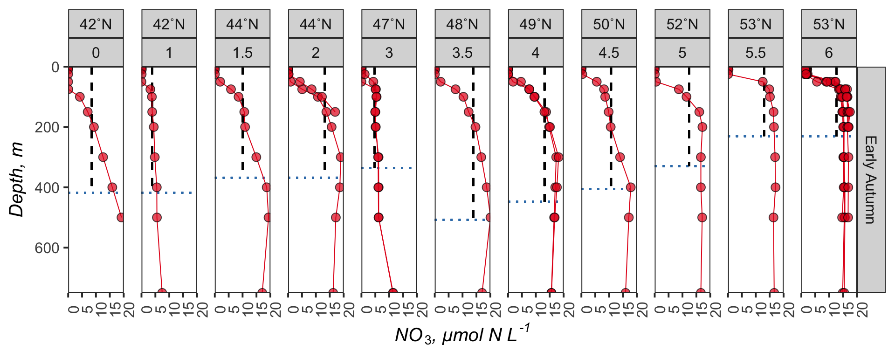
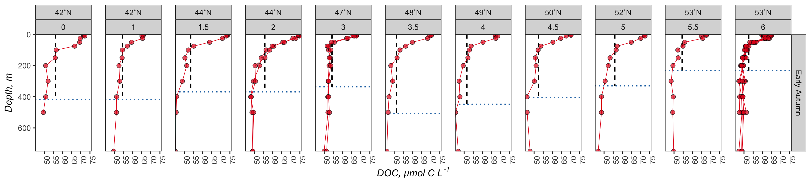

Processed Export for Bioavailability MS
================
Nicholas Baetge
2/7/2020

# Intro

This document is shows how nitrate drawdown and NCP were calculated from
the processed bottle
file

# Import Data

``` r
processed_bf <-  read_rds("~/GITHUB/naames_export_ms/Output/processed_bf.2.2020.rds")
```

# Subset Relevent Data

``` r
#select nutrient and phytoplankton data for N2 and N3 
npp <- read_xlsx("~/GITHUB/naames_bioav_ms/Input/NPP for Nick.xlsx", sheet = 2) %>% 
  filter(!station %in% c("NA","N4S2RF")) %>% 
  separate(station, into = c("Cruise", "Station"), sep = "S") %>% 
  select(-Cruise) %>% 
  mutate(Cruise = ifelse(Bloom_phase == "Accumulation phase", "AT39-6", NA),
         Cruise = ifelse(Bloom_phase == "Climax transition", "AT34", Cruise),
         Cruise = ifelse(Bloom_phase == "Equilibrium phase", "AT38", Cruise),
         Cruise = ifelse(Bloom_phase == "Winter transition", "AT32", Cruise)) %>%
  mutate(date = ymd(date)) %>% 
  select(Cruise, date, Station, Ez) %>% 
  mutate(Station = ifelse(Station %in% c("4a", "4b", "4c", "4d"), 4, Station),
         Station = ifelse(Station %in% c("6a", "6b", "6c", "6d", "6e"), 6, Station),
         Station = as.numeric(Station)) %>% 
  rename(Date = date) 

subset <- processed_bf %>% 
  #omitting CampCN 98 because only measurements at 5 m and below 1500 m were taken. the interpolated values for this cast were as a result, not reliable
  filter(Cruise %in% c("AT32", "AT34", "AT38", "AT39-6"),
         !CampCN == 98) %>% 
  #the multiday N2S4 drifted from the 48˚Lat bin to the 47˚Lat bin, but was a lagrangian study (followed float), so we'll denote all casts within station 4 as being in the 48˚N bin. This also occured with N1S7 - casts will be in the 40˚ bin with a max MLD of 484 m
  mutate(degree_bin = ifelse(Cruise == "AT34" & Station == "4", 48, degree_bin),
         degree_bin = ifelse(Cruise == "AT32" & Station == "7", 40, degree_bin),
         Max_MLD = ifelse(Cruise == "AT34" & Station == "4", 508, Max_MLD),
          Max_MLD = ifelse(Cruise == "AT32" & Station == "7", 484, Max_MLD),) %>% 
  select(Cruise, Latitude, Longitude, Date, degree_bin, Station, Season, Subregion,  CampCN, Max_MLD,  Target_Z,  interp_DOC, interp_N_N, interp_NO2, interp_NH4, interp_TDN, interp_PO4, interp_SiO4, interp_POC_uM, Density00, Density11) %>% 
  #add column that averages the density measurements
  mutate(p = (Density00 + Density11)/2) %>%
  distinct() %>% 
  #calculate nitrate for each cast, replacing values less than 0 with 0
  group_by(CampCN) %>% 
  mutate(N = interp_N_N - interp_NO2,
         DON = interp_TDN - interp_N_N - interp_NH4,
         N = ifelse(N < 0, 0, N),
         p5 = ifelse(Target_Z == 5, p, NA),
         p10 = ifelse(Target_Z == 10, p, NA),
         p = ifelse(Target_Z == 0, max(p5, na.rm = T) , p),
         p = ifelse(Target_Z == 0 | is.na(p), max(p10, na.rm = T) , p)) %>% 
  select(-c(interp_N_N, interp_NO2, interp_NH4, interp_TDN, Density00, Density11, p5, p10)) %>% 
  ungroup() %>% 
  full_join(., npp) %>% 
  select(Cruise:Max_MLD, Ez, Max_MLD,  everything()) %>% 
  group_by(Cruise, Station) %>% 
  mutate(ave_Ez = mean(Ez, na.rm = T),
         sd_Ez = sd(Ez, na.rm = T)) %>% 
  ungroup() %>% 
  rename(interp_POC = interp_POC_uM) %>% 
  #POC at 150 m is questionble so they will be omitted from further analysis (per comm. J Graff) %>% 
  mutate(interp_POC = ifelse(Target_Z == 150, NA, interp_POC))
```

    ## Joining, by = c("Cruise", "Date", "Station")

# Interpolate Depth of Euphotic Zone

We’ll interpolate variables to the depth of the euphotic zone for each
cast separately

``` r
#split the df by CampCN  
add_ez.list <- split(subset, subset$CampCN)

#create a function to add an empty row to each cast, then add the max MLD to the Target Z column 
add.func <- function(morty){
  morty[nrow(morty) + 1,] <- NA
  morty$Target_Z[is.na(morty$Target_Z)] <- morty$Ez
  rick <- morty %>% 
    fill(., Cruise:Max_MLD, .direction = c("updown")) %>% 
    arrange(CampCN, Target_Z)
  
  }

#apply function to list 
added_ez.list <- lapply(add_ez.list, add.func)


#save the list as a data frame 
added_ez.df <- plyr::ldply(added_ez.list, data.frame) %>% 
  group_by(CampCN) %>% 
  distinct(., Target_Z, .keep_all = T) %>% 
  select(-.id) %>% 
  ungroup() %>% 
  filter(!Target_Z == "-Inf")


#split the data frame into lists based on the campaign cast number
to_interpolate.list <- split(added_ez.df, added_ez.df$CampCN)

#create a function that will linearly interpolate each VOI according to the depth intervals of the casts 
interpolate.func <- function(copper) {
to_interpolate.df <- copper %>% 
  select(Target_Z:ncol(.)) %>% 
  zoo(., order.by = .$Target_Z) 

interp_doc <- as.numeric(na.approx(to_interpolate.df$interp_DOC, na.rm = F))
interp_don <- as.numeric(na.approx(to_interpolate.df$DON, na.rm = F))
interp_Si <- as.numeric(na.approx(to_interpolate.df$interp_SiO4, na.rm = F))
interp_N <- as.numeric(na.approx(to_interpolate.df$N, na.rm = F))
interp_PO4 <- as.numeric(na.approx(to_interpolate.df$interp_PO4, na.rm = F))
interp_POC <- as.numeric(na.approx(to_interpolate.df$interp_POC, na.rm = F))
interp_p <- as.numeric(na.approx(to_interpolate.df$p, na.rm = F))
Target_Z <- to_interpolate.df$Target_Z
interpolations.df <- data.frame(Target_Z, interp_doc, interp_don, interp_Si,interp_N, interp_PO4, interp_POC, interp_p)
}

#apply function to list 
interpolations.list <- lapply(to_interpolate.list, interpolate.func)

#save the list as a data frame 
interpolations.df <- plyr::ldply(interpolations.list, data.frame) %>% 
  rename(., CampCN = .id) 

#combine the interpolated and non-interpolated data frames
interpolations.df$CampCN <- as.numeric(interpolations.df$CampCN)
interpolated.df <- right_join(subset, interpolations.df) %>% 
  select(Cruise:Max_MLD, Ez, ave_Ez:sd_Ez, Target_Z, interp_p, interp_N, interp_PO4, interp_Si, interp_doc, interp_don, interp_POC ) %>% 
  group_by(CampCN) %>% 
  fill(Cruise:Subregion, Max_MLD:sd_Ez, .direction = "updown") %>% 
  ungroup()
```

## Average Variable Values

We’ll use these averages to redistribute profiles

``` r
to_redis <- interpolated.df %>%
  group_by(Cruise, Station, Target_Z) %>% 
  mutate(ave_p = mean(interp_p, na.rm = T),
         sd_p = sd(interp_p, na.rm = T),
         ave_N = mean(interp_N, na.rm = T),
         ave_N = ifelse(ave_N == "Nan", NA, ave_N),
         sd_N = sd(interp_N, na.rm = T),
         ave_PO4 = mean(interp_PO4, na.rm = T),
         ave_PO4 = ifelse(ave_N == "Nan", NA, ave_PO4),
         sd_PO4 = sd(interp_PO4, na.rm = T),
         ave_DOC = mean(interp_doc, na.rm = T),
         ave_DOC = ifelse(ave_N == "Nan", NA, ave_DOC),
         sd_DOC = sd(interp_doc, na.rm = T),
         ave_DON = mean(interp_don, na.rm = T),
         ave_DON = ifelse(ave_N == "Nan", NA, ave_DON),
         sd_DON = sd(interp_don, na.rm = T),
         ave_POC = mean(interp_POC, na.rm = T),
         ave_POC = ifelse(ave_N == "Nan", NA, ave_POC),
         sd_POC = sd(interp_POC, na.rm = T),
         ave_Si = mean(interp_Si, na.rm = T),
         ave_Si = ifelse(ave_N == "Nan", NA, ave_Si),
         sd_Si = sd(interp_Si, na.rm = T),
         
         
         
         
  ) %>% 
  ungroup() %>% 
  group_by(Cruise, Station) %>% 
  mutate(ave_lat = round(mean(Latitude, na.rm = T), 2),
         ave_lon = round(mean(Longitude, na.rm = T), 2),
         ave_date = mean(Date)) %>% 
  select(-contains("Ez")) %>% 
  select(Cruise, ave_lat, ave_lon, ave_date, degree_bin:Subregion, Max_MLD:Target_Z, ave_p:sd_Si) %>%
  distinct() %>% 
  arrange(Cruise, Station, Target_Z) %>% 
  ungroup()
```

# Redistribute Nutrient Profiles

``` r
redis_N <- to_redis %>% 
  drop_na(ave_N, ave_Si, ave_PO4) %>% 
  group_by(Cruise, Station) %>% 
  filter(Target_Z <= Max_MLD) %>% 
  mutate(redis_N_vol = integrateTrapezoid(Target_Z, ave_N, type = "A")/Max_MLD,
         redis_Si_vol = integrateTrapezoid(Target_Z, ave_Si,type = "A")/Max_MLD,
         redis_PO4_vol = integrateTrapezoid(Target_Z, ave_PO4,type = "A")/Max_MLD) %>% 
  select(Cruise, Station,  degree_bin, redis_N_vol, redis_Si_vol, redis_PO4_vol) %>% 
  distinct() %>% 
  ungroup() %>% 
  #we want to apply the same depth normalized values from the summer cruise to the spring profiles and the late autumn, where there are overlapping latitudinal bins. 
  #there are stations in the latitudinal bins of 44, 48, and 50˚N for all cruises. 
  #because there are two stations at 44˚N within the summer cruise, we will apply the mean
  #redistribution value of that station to the 44˚N station of the spring cruise
  group_by(degree_bin) %>% 
  arrange(degree_bin) %>% 
  mutate(redis_N_vol = ifelse(Cruise %in% c("AT34", "AT39-6") & degree_bin %in% c(42, 44,48,50), NA, redis_N_vol),
         redis_Si_vol = ifelse(Cruise %in% c( "AT34", "AT39-6") & degree_bin %in% c(42, 44,48,50), NA, redis_Si_vol),
         redis_PO4_vol = ifelse(Cruise %in% c( "AT34", "AT39-6") & degree_bin %in% c(42, 44,48,50), NA, redis_PO4_vol),
         ave_redis_N = mean(redis_N_vol, na.rm = T),
         redis_N_vol = ifelse(is.na(redis_N_vol) & degree_bin == 44, ave_redis_N, redis_N_vol),
         ave_redis_Si = mean(redis_Si_vol, na.rm = T),
         redis_Si_vol = ifelse(is.na(redis_Si_vol) & degree_bin == 44, ave_redis_Si, redis_Si_vol),
         ave_redis_PO4 = mean(redis_PO4_vol, na.rm = T),
         redis_PO4_vol = ifelse(is.na(redis_PO4_vol) & degree_bin == 44, ave_redis_Si, redis_Si_vol)) %>% 
  select(-c(ave_redis_N, ave_redis_Si, ave_redis_PO4)) %>% 
  fill(redis_N_vol:redis_PO4_vol, .direction = "updown") %>% 
  ungroup()
```

# Redistribute DOC Profiles

``` r
redis_DOC <- to_redis %>% 
  drop_na(ave_DOC) %>% 
  group_by(Cruise, Station) %>% 
  filter(Target_Z <= Max_MLD) %>% 
  mutate(redis_DOC_vol = integrateTrapezoid(Target_Z, ave_DOC, type = "A")/Max_MLD) %>% 
  select(Cruise, Station,  degree_bin, redis_DOC_vol) %>% 
  distinct() %>% 
  ungroup() %>% 
  group_by(degree_bin) %>% 
  arrange(degree_bin) %>% 
  mutate(redis_DOC_vol = ifelse(Cruise %in% c( "AT34", "AT39-6") & degree_bin %in% c(42, 44,48,50), NA, redis_DOC_vol),
         ave_redis_DOC = mean(redis_DOC_vol, na.rm = T),
         redis_DOC_vol = ifelse(is.na(redis_DOC_vol) & degree_bin == 44, ave_redis_DOC, redis_DOC_vol)) %>% 
  select(-c(ave_redis_DOC)) %>% 
  fill(redis_DOC_vol, .direction = "updown") %>% 
  ungroup()
```

# Redistribute DON Profiles

``` r
redis_DON <- to_redis %>% 
  drop_na(ave_DON) %>% 
  group_by(Cruise, Station) %>% 
  filter(Target_Z <= Max_MLD) %>% 
  mutate(redis_DON_vol = integrateTrapezoid(Target_Z, ave_DON, type = "A")/Max_MLD) %>% 
  select(Cruise, Station,  degree_bin, redis_DON_vol) %>% 
  distinct() %>% 
  ungroup() %>% 
  group_by(degree_bin) %>% 
  arrange(degree_bin) %>% 
  mutate(redis_DON_vol = ifelse(Cruise %in% c("AT34", "AT39-6") & degree_bin %in% c(42, 44,48,50), NA, redis_DON_vol),
         ave_redis_DON = mean(redis_DON_vol, na.rm = T),
         redis_DON_vol = ifelse(is.na(redis_DON_vol) & degree_bin == 44, ave_redis_DON, redis_DON_vol)) %>% 
  select(-c(ave_redis_DON)) %>% 
  fill(redis_DON_vol, .direction = "updown") %>% 
  ungroup()
```

# Redistribute POC Profiles

``` r
redis_POC <- to_redis %>% 
  drop_na(ave_POC) %>% 
  group_by(Cruise, Station) %>% 
  filter(Target_Z <= Max_MLD) %>% 
  mutate(redis_POC_vol = integrateTrapezoid(Target_Z, ave_POC, type = "A")/Max_MLD) %>% 
  select(Cruise, Station,  degree_bin, redis_POC_vol) %>% 
  distinct() %>% 
  ungroup() %>% 
  group_by(degree_bin) %>% 
  arrange(degree_bin) %>% 
  mutate(redis_POC_vol = ifelse(Cruise %in% c("AT34", "AT39-6") & degree_bin %in% c(42, 44,48,50), NA, redis_POC_vol),
         ave_redis_POC = mean(redis_POC_vol, na.rm = T),
         redis_POC_vol = ifelse(is.na(redis_POC_vol) & degree_bin == 44, ave_redis_POC, redis_POC_vol)) %>% 
  select(-c(ave_redis_POC)) %>% 
  fill(redis_POC_vol, .direction = "updown") %>% 
  ungroup()
```

# Calculate Mixed Profile Areas in Ez and surface 100 m

``` r
redis_areas <- interpolated.df %>% 
  left_join(., redis_N) %>% 
  left_join(., redis_DOC) %>% 
  left_join(., redis_DON) %>% 
  mutate(redis_N_ez_area = redis_N_vol * Ez,
         redis_N_100_area = redis_N_vol * 100,
         redis_PO4_ez_area = redis_PO4_vol * Ez,
         redis_PO4_100_area = redis_PO4_vol * 100,
         redis_DOC_ez_area = redis_DOC_vol * Ez,
         redis_DOC_100_area = redis_DOC_vol * 100,
         redis_DON_ez_area = redis_DON_vol * Ez,
         redis_DON_100_area = redis_DON_vol * 100)
```

# Integrate Nutrient Profiles

``` r
int_N <- redis_areas %>% 
  drop_na(interp_N, interp_Si) %>% 
  group_by(Cruise, Station, CampCN) %>% 
  filter(Target_Z <= Max_MLD) %>%
   mutate(int_N_maxmld = integrateTrapezoid(Target_Z, interp_N,type = "A"),
         int_Si_maxmld = integrateTrapezoid(Target_Z, interp_Si,type = "A"),
         int_PO4_maxmld = integrateTrapezoid(Target_Z, interp_PO4,type = "A")) %>% 
  filter(Target_Z <= Ez) %>%
   mutate(int_N_ez = integrateTrapezoid(Target_Z, interp_N,type = "A"),
         int_Si_ez = integrateTrapezoid(Target_Z, interp_Si,type = "A"),
          int_PO4_ez = integrateTrapezoid(Target_Z, interp_PO4,type = "A")) %>% 
  ungroup() %>% 
  select(Cruise, Station, CampCN,  int_N_ez:int_PO4_ez) %>% 
  distinct() %>% 
  full_join(., redis_areas %>% 
              drop_na(interp_N, interp_Si) %>% 
              group_by(Cruise, Station, CampCN) %>% 
              filter(Target_Z <= 100) %>%
              mutate(int_N_100 = integrateTrapezoid(Target_Z, interp_N,type = "A"),
                     int_Si_100 = integrateTrapezoid(Target_Z, interp_Si,type = "A"),
                     int_PO4_100 = integrateTrapezoid(Target_Z, interp_PO4,type = "A")) %>% 
              ungroup() %>% 
              select(Cruise, Station, CampCN,  int_N_100:int_PO4_100) %>%
              distinct() 
  ) %>% 
  arrange(CampCN)
```

# Integrate DOC Profiles

``` r
int_DOC <- redis_areas %>% 
  drop_na(interp_doc) %>% 
  group_by(Cruise, Station, CampCN) %>% 
  filter(Target_Z <= Max_MLD) %>%
  mutate(int_DOC_maxmld = integrateTrapezoid(Target_Z, interp_doc,type = "A")) %>% 
  filter(Target_Z <= Ez) %>%
  mutate(int_DOC_ez = integrateTrapezoid(Target_Z, interp_doc,type = "A")) %>% 
  ungroup() %>% 
  select(Cruise, Station, CampCN, int_DOC_ez) %>% 
  distinct() %>% 
  full_join(., redis_areas %>% 
              drop_na(interp_doc) %>%
              group_by(Cruise, Station, CampCN) %>% 
              filter(Target_Z <= 100) %>%
              mutate(int_DOC_100 = integrateTrapezoid(Target_Z,
                                                      interp_doc,type = "A")) %>% 
              ungroup() %>% 
              select(Cruise, Station, CampCN, int_DOC_100) %>% 
              distinct() 
            ) %>% 
  arrange(CampCN)
```

# Integrate DON Profiles

``` r
int_DON <- redis_areas %>% 
  drop_na(interp_don) %>% 
  group_by(Cruise, Station) %>% 
  filter(Target_Z <= Max_MLD) %>%
  mutate(int_DON_maxmld = integrateTrapezoid(Target_Z, interp_don,type = "A")) %>% 
  filter(Target_Z <= Ez) %>%
  mutate(int_DON_ez = integrateTrapezoid(Target_Z, interp_don,type = "A")) %>% 
  ungroup() %>% 
  select(Cruise, Station, CampCN, int_DON_ez) %>% 
  distinct() %>% 
  full_join(., redis_areas %>% 
              drop_na(interp_don) %>%
              group_by(Cruise, Station, CampCN) %>% 
              filter(Target_Z <= 100) %>%
              mutate(int_DON_100 = integrateTrapezoid(Target_Z,
                                                      interp_don,type = "A")) %>% 
              ungroup() %>% 
              select(Cruise, Station, CampCN, int_DON_100) %>% 
              distinct() 
            ) %>% 
  arrange(CampCN)
```

# Calculate ∆NO<sub>3</sub>, NCP, ∆SiO<sub>4</sub>, ∆DOC in Ez and top 100 m

``` r
processed_export <- redis_areas %>% 
  left_join(., int_N) %>% 
  left_join(., int_DOC) %>% 
  left_join(., int_DON) %>% 
  group_by(Cruise, Station, CampCN) %>% 
  mutate(delta_N = redis_N_vol - interp_N,
         NCP_umol = delta_N * 6.6,
         delta_Si = redis_Si_vol - interp_Si,
         delta_PO4 = redis_PO4_vol - interp_PO4,
         delta_DOC = interp_doc - redis_DOC_vol,
         delta_DON = interp_doc - redis_DON_vol,
         
         int_delta_N_ez = (redis_N_ez_area - int_N_ez)/1000,
         int_delta_PO4_ez = (redis_PO4_ez_area - int_PO4_ez)/1000,
         NCP_mol_ez = int_delta_N_ez * 6.6,
         
         int_delta_DOC_ez = (int_DOC_ez - redis_DOC_ez_area)/1000,
         int_delta_DON_ez = (int_DON_ez - redis_DON_ez_area)/1000,
         
         int_delta_DOC_100 = (int_DOC_100 - redis_DOC_100_area)/1000,
         
         int_delta_N_100 = (redis_N_100_area - int_N_100)/1000,
         NCP_mol_100 = int_delta_N_100 * 6.6,
  
         doc_ncp = delta_DOC/NCP_umol,
         doc_ncp_ez = int_delta_DOC_ez/NCP_mol_ez,
         doc_ncp_100 = int_delta_DOC_100/NCP_mol_100,
         
         doc_don = delta_DOC/delta_DON,
         doc_don_ez = int_delta_DOC_ez/int_delta_DON_ez) %>% 
  ungroup() %>% 
  distinct()

processed_export[ is.na(processed_export) ] <- NA
```

# Save Data

``` r
saveRDS(processed_export, "~/GITHUB/naames_export_ms/Output/processed_export_for_bioavMS.6.7.20.rds")
saveRDS(processed_export, "~/GITHUB/naames_bioav_ms/Input/processed_export_for_bioavMS.6.7.20.rds")
```

# Plot Profiles

## Nitrate




